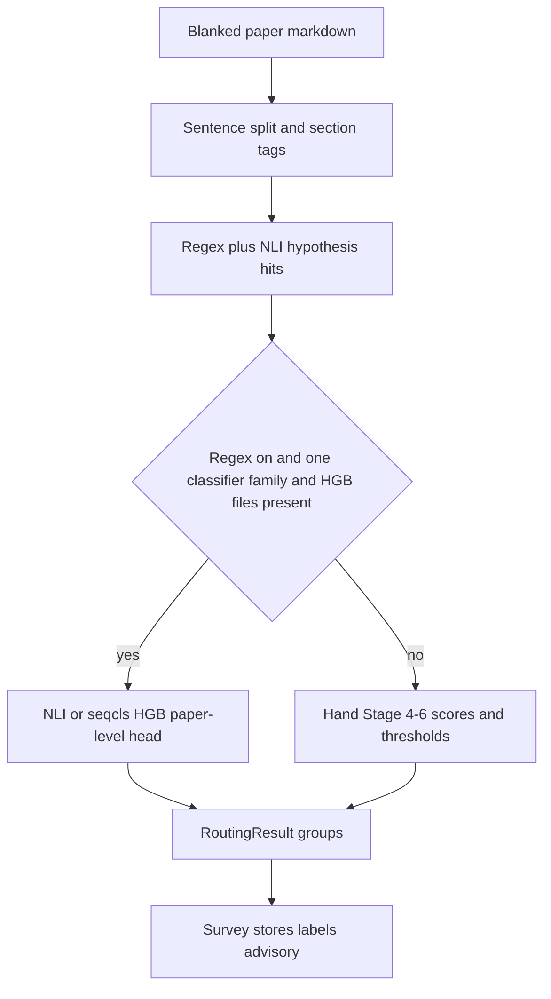

# paper_routing

WG21 review-group classifier. It assigns a paper zero or more of LEWG, LWG, EWG, and CWG. A paper may receive more than one. Zero groups means the paper looks administrative (a trip report, poll, or other non-proposal).

The work is two layers. Sentence scoring marks hypotheses on each sentence. The paper-level head turns those hits into the four labels. Assay Survey (step 3) runs regex catalog hits, `nli-small`, and the frozen NLI HGB head. Labels are advisory. They do not skip the rest of assay. Survey triage can skip wording-dominant and reference documents before routing runs.

This directory depends only on `pipeline.classifier_backends`, `pipeline.nli_batch`, and `pipeline.markdown`. It can stand alone if a non-assay consumer appears.

## Usage

Public names: `route_paper`, `RoutingResult`, `RoutingGroup`, `HypothesisAxis`.

```python
from assay.paper_routing import route_paper

result = route_paper(
    paper_md,
    audience=audience,
    classifiers=classifier,  # NLI or seqcls backend; Survey uses nli-small
    use_regex=True,
    use_learned_aggregator=True,
)
print(sorted(g.value for g in result.groups))
print(result.is_administrative)
```

Assay Survey passes markdown already blanked in Receive (front matter, revision history, acknowledgements). Callers that pass raw markdown can still pick up appendix-style hits. See [`../heading_classifiers.py`](../heading_classifiers.py) `is_appendix_heading_line`.

HGB needs regex on, one classifier family (all NLI or all seqcls), and that family's files on disk. Mixed NLI+seqcls, regex off, or missing files use the hand Stage 4-6 path instead.

## Sentence hits then a paper-level head

The June spec lists six stages ([`../../../../../paper-routing-classifier.md`](../../../../../paper-routing-classifier.md)). As shipped, those stages are two jobs.

The first job scores each sentence against a hypothesis catalog. Regex matchers fire when `use_regex` is true. NLI or a fine-tuned sequence classifier can add hits on top. Assay keeps regex on because the frozen HGB heads were trained on regex plus classifier hits.

The second job is the paper-level head. Production uses HGB when the gate above passes. Otherwise it uses the spec's Stage 4-6 hand math: section weights, a sustained-count gate, and fixed thresholds (Figure 1).

**Figure 1.** Production path: regex plus NLI hits, then HGB when eligible, else hand Stage 4-6.



NLI HGB files live under [`../../../data/nli/`](../../../data/nli/). Seqcls HGB files live under [`../../../data/seqcls/`](../../../data/seqcls/). Shared feature names and group order live under [`../../../data/routing/`](../../../data/routing/).

The four groups sit on a 2x2 grid: library vs language, and design vs wording. LEWG is library design, LWG is library wording, EWG is language design, CWG is language wording.

## Assay Survey uses regex, nli-small, and NLI HGB

[`../assay.md`](../assay.md) Classifiers: Survey routing is regex plus `selector: nli-small` plus the frozen NLI HGB aggregator. `_run_paper_routing` in [`../pipeline.py`](../pipeline.py) passes `use_regex=True` and `use_learned_aggregator=True`.

## Six named stages, with HGB on 4-6

Table 1 maps the spec's stage names to what this package does today.

**Table 1.** Stage names from `paper-routing-classifier.md` and what ships here.

| Stage | Spec name                               | As shipped                                                           |
| ----- | --------------------------------------- | -------------------------------------------------------------------- |
| 1     | Sentence splitting                      | Split markdown; drop units under 20 characters; section-stratified sample to 300 (Hamilton quotas, stride, APPENDIX excluded) |
| 2     | Section detection                       | Tag each sentence from headings                                      |
| 3     | Hypothesis scoring                      | Regex catalog, then NLI (production) or seqcls                       |
| 4-6   | Aggregation, sustained test, thresholds | HGB paper-level head on the production path; hand math as fallback   |

The spec still calls Stage 4 the most important stage and says Stages 2, 4, 5, and 6 need no ML. Production assay replaces that 4-6 block with HGB when the eligibility gate passes. The spec file is unchanged.

## Layout

| File                                           | Job                                                         |
| ---------------------------------------------- | ----------------------------------------------------------- |
| `routing.py`                                   | `route_paper`, `RoutingResult`, HGB-vs-hand gate            |
| `types.py`                                     | `RoutingGroup`, `HypothesisAxis`, `Sentence`, section types |
| `split.py`                                     | Stage 1 sentence split                                      |
| `sample.py`                                    | Section-stratified stride cap (300 sentences)               |
| `headings.py` / `sections.py`                  | Stage 2 heading to section type                             |
| `standardese.py`                               | Normative-element hints for splitting                       |
| `hypotheses.py`                                | Stage 3 catalog and scoring                                 |
| `seqcls_thresholds.py`                         | Per-label seqcls cutoffs                                    |
| `learned_aggregate.py`                         | Frozen HGB paper-level head                                 |
| `features.py`                                  | Paper-wide feature vector for HGB                           |
| `aggregate.py` / `threshold.py` / `sustain.py` | Hand Stage 4-6                                              |
| `axis_hist.py` / `audience.py`                 | Shared axis hits and audience phrases                       |

## Limits

Routing emits only LEWG, LWG, EWG, and CWG. Study Groups have no labels. This is not a substitute for committee assignment.

Routing scores at most 300 sentences (Hamilton quotas by section, stride inside each section, APPENDIX excluded) and ignores units shorter than 20 characters. Section tags come from headings; mixed design and wording under one heading still confuses stage 2. The hand fallback still uses a sustained-count gate; production HGB does not use that gate to emit labels. Audience metadata is a weak signal, not an override.

Held-out numbers and the NLI+HGB default are in [`../../../data/routing/report_hgb_adoption.md`](../../../data/routing/report_hgb_adoption.md).
