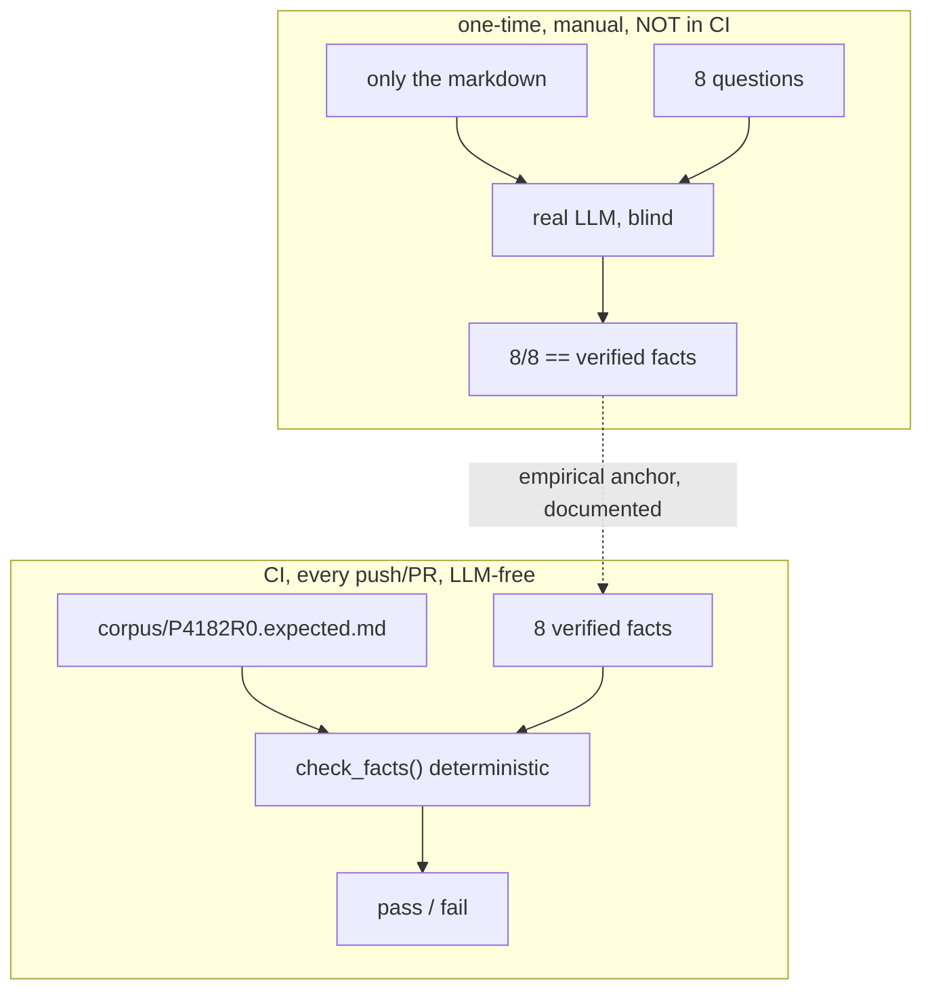

# Comprehension POC report: proving converted markdown is LLM-readable

Status: proof-of-concept landed for one paper (P4182R0). Not yet committed.
Audience: a partner picking up this work. This report is self-contained: it states
the goal, what already existed, what we built, every command we ran, the evidence,
and what is still open.

## 1. The goal (what we wanted to achieve)

tomd converts WG21 PDF/HTML papers to markdown. The existing tests answer
"does the output look faithful" (golden byte-diffs, fidelity metrics like
nid/teds/mhs, content coverage). None of them answer the question that actually
matters for the downstream analytical pipelines:

> Can an LLM that consumes the converted markdown still READ it correctly:
> recover the paper's facts, look up the right table cell, follow the section
> order, not be fed page furniture?

A faithful-looking reflow can still scramble a table so "row 3, column 2" reads
wrong, and every fidelity metric stays green. We wanted a test that gates on
read -> understood -> correct, not on resemblance to a golden file.

## 2. What already existed (audit findings)

We audited the whisker package and 28 surveyed external converter repos
(`packages/whisker/research/redteam/`). Findings:

- whisker already had the right design on paper: a **Lane 3 Comprehension**
  engine (`facts.py`, `whisker facts`) using deterministic, human-verified fact
  assertions (`present` / `absent` / `order` / `table` / `math`), no LLM in the
  scoring loop. This mirrors **olmOCR**, the only one of the 28 surveyed
  converters that tests comprehension at all.
- BUT Lane 3 ran on **zero** real papers. The corpus held only
  `corpus/EXAMPLE.facts.jsonl`. There was no committed corpus member, no
  CI test exercising it, and whisker was **missing from the CI matrix** entirely.
- The `whisker facts` CLI reads the candidate markdown from the paperstore
  backend (`data/`, gitignored, absent in CI), so it is a dev-time tool and
  cannot gate in CI by itself.

So the gap was: a correct engine with no real data, no CI gate, and no empirical
proof that the deterministic facts actually track what an LLM reads.

## 3. The approach

Two layers, deliberately separated:

1. **Deterministic gate (runs in CI, no LLM).** Freeze the converted markdown as
   a committed substrate, author a handful of human-verified facts about it, and
   assert (via `check_facts`) that those facts are mechanically recoverable from
   the markdown. No LLM, no network: reproducible, free, deterministic. This is
   the olmOCR model.
2. **One-time empirical LLM read-back (manual, NOT in CI).** Exactly the step the
   original plan called for ("test it once with an agent chat, then write the
   tests that must pass"). Hand a fresh LLM ONLY the converted markdown plus the
   questions, let it answer blind, and compare to the verified facts. If it
   matches, the deterministic facts are proven to be a faithful proxy for what
   the LLM recovers. We do this once and document it; we do not put an LLM in CI
   (determinism, cost, model-sovereignty).

We rejected a "regenerate similar text" round-trip: LLMs paraphrase, so
resemblance measures fidelity again, not comprehension. The test is question
answering ("row X, column Y reads what?").

## 4. The paper: P4182R0

P4182R0 ("A Citable Inventory of Platforms, Operating Systems, and Compiler
Toolchains") is table-heavy (two platform tables, a compiler table, per-section
field/value tables), which makes it a strong table-comprehension subject. We
confirmed it converts close to 100% (see whisker numbers in section 7) and used
it as the first corpus member.

## 5. What we built (files)

All under `packages/whisker/`:

- `corpus/P4182R0.expected.md` - the frozen golden snapshot (412 lines). Proven
  byte-identical to `run_pipeline`'s output (diff = 0, no uncertain regions). It
  doubles as the comprehension substrate.
- `corpus/P4182R0.facts.jsonl` - 8 `checked: verified` facts: 4 `present`,
  1 `absent`, 1 `order`, 2 `table`. (`math` is honestly N/A for this paper: it
  has no formulas. The math type will be exercised by a future math-heavy paper.)
- `corpus/P4182R0.validation.md` - the one-time empirical LLM read-back record
  (inert to all corpus loaders; not a CI gate).
- `tests/test_comprehension_corpus.py` - the hermetic CI gate. Reads the committed
  `expected.md` + `facts.jsonl`, runs `check_facts`, asserts every verified fact
  holds, asserts at least one verified fact exists (no vacuous green), and a
  canary asserts a scrambled snapshot FAILS.
- `.github/workflows/tests.yml` - added `whisker` to the package-tests matrix
  (it was absent), so the gate runs on every push/PR on Ubuntu + Windows.

### The 8 facts (and why the table ones matter)

| id | type | assertion | source location |
|----|------|-----------|-----------------|
| title-survives | present | the full document title is recoverable | title / front matter |
| edg-frontend | present | "Edison Design Group supplies a commercial C++" | section 4.7 |
| pmr-term | present | "polymorphic memory resources" | section 4.3 |
| pigweed-coro | present | "Pigweed provides C++20 coroutines" | section 3.6 |
| docnumber-label-consumed | absent | the label "Document Number" does NOT leak into the body (it became front-matter `document:`) | page 1 metadata |
| section-flow | order | Abstract -> Motivation -> Platform schema -> Compiler schema -> Acknowledgments | document flow |
| tableA-gpu-coro-no | table | Table A, row "GPU device code (CUDA, SYCL)", Coro column reads "No", heading "Category" | Table A, 3.1 |
| tableB-console-alloc | table | Table B, "Arenas common" cell (Game-consoles row, Alloc column): left = "Often off", heading = "Alloc" | Table B, 3.1 |

The two `table` facts are the load-bearing cases: they test "row X, column Y
still reads correctly", the exact failure that fidelity metrics (teds/mhs/nid)
can wave through.

## 6. Every command we ran

PowerShell, from the repo root. `WG21_DATA_DIR` points at the data dir holding
`paperstore.db` (gitignored). The CI gate itself needs none of this (it reads the
committed corpus), but the dev-time steps below do.

```powershell
$env:WG21_DATA_DIR = "C:\Users\sabog\Desktop\cppalliance\cppalliance\data"

# Confirm the paper is staged + converted
Get-ChildItem "$env:WG21_DATA_DIR\paperstore" -Filter "*4182*"

# whisker verdict, reference-based (vs markitdown oracle) and reference-free
uv run --package whisker whisker P4182R0 --no-write -v
uv run --package whisker whisker P4182R0 --no-reference --no-write -v

# Prove run_pipeline output == the blessed data markdown (byte-identical)
uv run --package tomd python -c "from tomd.lib.pdf import run_pipeline; from pathlib import Path; r=run_pipeline(Path(r'...\data\paperstore\p4182r0.pdf')); data=Path(r'...\data\paperstore\p4182r0.md').read_text(encoding='utf-8'); print('identical', r.md.strip()==data.strip(), 'prompts', r.prompts)"

# Freeze the golden snapshot into the corpus
uv run --package tomd python -c "from tomd.lib.pdf import run_pipeline; from pathlib import Path; r=run_pipeline(Path(r'...\data\paperstore\p4182r0.pdf')); Path(r'...\packages\whisker\corpus\P4182R0.expected.md').write_text(r.md, encoding='utf-8')"

# Runtime-check the facts against the snapshot (draft, then verified)
uv run --package whisker python -c "from whisker.facts import parse_facts_jsonl, check_facts; from pathlib import Path; base=Path(r'...\packages\whisker\corpus'); md=(base/'P4182R0.expected.md').read_text(encoding='utf-8'); facts=parse_facts_jsonl((base/'P4182R0.facts.jsonl').read_text(encoding='utf-8-sig'),'P4182R0'); rep=check_facts(md,facts,'P4182R0'); print('passed', rep.passed, 'verified', len(rep._enforced()), rep.by_type())"

# Baseline + the new test, hermetic (no WG21_DATA_DIR needed for these)
uv run --package whisker pytest packages/whisker/tests -q
uv run --package whisker pytest packages/whisker/tests/test_comprehension_corpus.py -v
uv run ruff check packages/whisker/tests/test_comprehension_corpus.py

# Exactly what CI runs for the whisker job (no data dir)
uv run pytest packages/whisker/tests
```

## 7. Evidence

- **Golden == converter output:** `identical=True`, diff = 0 lines, `prompts=None`
  (zero uncertain regions). The committed `expected.md` is exactly what tomd
  produces and what the user eyeballed as correct.
- **Deterministic facts:** `passed=True`, 8/8 verified, per-type pass rate 1.0
  for present (4), absent (1), order (1), table (2).
- **New test:** 3 passed (corpus-nonempty guard, P4182R0 verified facts, canary).
  The canary corrupts one Table A cell ("No" -> "Yes" in the GPU row) and confirms
  the `tableA-gpu-coro-no` fact then FAILS: the gate has teeth.
- **Whisker hermetic suite:** 356 passed with no `WG21_DATA_DIR` (so it is safe in
  the CI matrix).
- **Lint:** clean.
- **One-time blind LLM read-back (3 runs, all 8/8):** a fresh, isolated LLM
  context received only the converted markdown plus the 8 questions and answered
  blind; answers matched the verified facts every time, including the two table
  cells. Run 3 was byte-exact: the subagent read the real committed
  `expected.md` (single file, 412 lines confirmed) and still answered 8/8. This
  is the empirical anchor that the deterministic facts track real LLM
  comprehension. Bonus: the blind reader noticed `### 1. Disclosure` is rendered
  as a `###` subheading under "Revision History" rather than its own `##` section,
  a minor tomd heading-nesting quirk (not a comprehension failure).

### Whisker numbers for P4182R0 (and how to read them)

Reference-free (the trustworthy content gate): `uni=0.954` (95.4% of source
word-tokens present), `cov=0.885`, `drift=0.099`, `qa=100`. Reference-based (vs
the markitdown oracle): `ovr=0.308`, `nid=0.872`, `teds=0.029`, `mhs=0.024`.

Read this correctly:

- The trustworthy numbers are `uni 95.4%` + `qa 100`. The paper is near-fully
  extracted.
- `teds 2.9%` / `mhs 2.4%` are NOT "bad tables/headings". They compare tomd
  against markitdown, which formats tables and headings completely differently,
  so the agreement is structurally near-zero. The code knows this and never gates
  on teds/mhs ("agreement != correctness"). `ovr` is just `(nid+teds+mhs)/3`, a
  display composite dragged down by that noise.
- The verdict is `review` (not `fail`), and the only reason is 2 misaligned
  reflow regions (`REGION_SOFT_COUNT = 1`). No hard fail, no missing content.
- The real proof that the tables are readable is the blind LLM read-back (3x 8/8),
  not the oracle's teds number.

## 8. How it runs in CI



The hermetic test is `packages/whisker/tests/test_comprehension_corpus.py`; it is
picked up by the `whisker` entry now present in the `package-tests` matrix of
`.github/workflows/tests.yml`.

## 9. Done vs open

Done:

- Lane 3 comprehension now runs in CI against a real, human-verified corpus
  member, with a canary proving the gate fails on a scrambled cell.
- P4182R0 frozen as the first corpus member; 8 verified facts; empirical LLM
  read-back passed 3x 8/8 and is documented.
- whisker added to the CI matrix; hermetic (no data dir) confirmed.

Open (deliberately deferred):

- More corpus members, especially a math-heavy and a more adversarial
  table-heavy paper (the `math` fact type is not yet exercised).
- Optional `P4182R0.gt.md` (hand-cleaned Lane 2 ground truth) so the dev-time
  `whisker guard`/`golden`/`facts` CLIs treat P4182R0 as a full corpus citizen
  against `data/`. Note: a `gt.md` that is just a copy of tomd's output measures
  nothing (teds trivially ~1.0); it must be independently hand-cleaned.
- The misleading `ovr` display composite could be repaired so a clean paper does
  not show an alarming 0.308 (the underlying gating already ignores teds/mhs).
- The `### 1. Disclosure` heading-nesting quirk could become a tomd observation
  or an `order`/structure fact.

## 10. Reproduce (for the partner)

The CI gate (LLM-free, deterministic, no data dir):

```powershell
uv run pytest packages/whisker/tests/test_comprehension_corpus.py
```

The dev-time whisker verdict (needs `WG21_DATA_DIR` and a converted paper):

```powershell
$env:WG21_DATA_DIR = "C:\path\to\data"
uv run --package whisker whisker P4182R0 --no-reference --no-write -v
```

The one-time blind read-back is manual: hand the contents of
`corpus/P4182R0.expected.md` (only that) plus the 8 questions in
`corpus/P4182R0.validation.md` to a fresh LLM context and compare its answers to
the verified facts in `corpus/P4182R0.facts.jsonl`.
