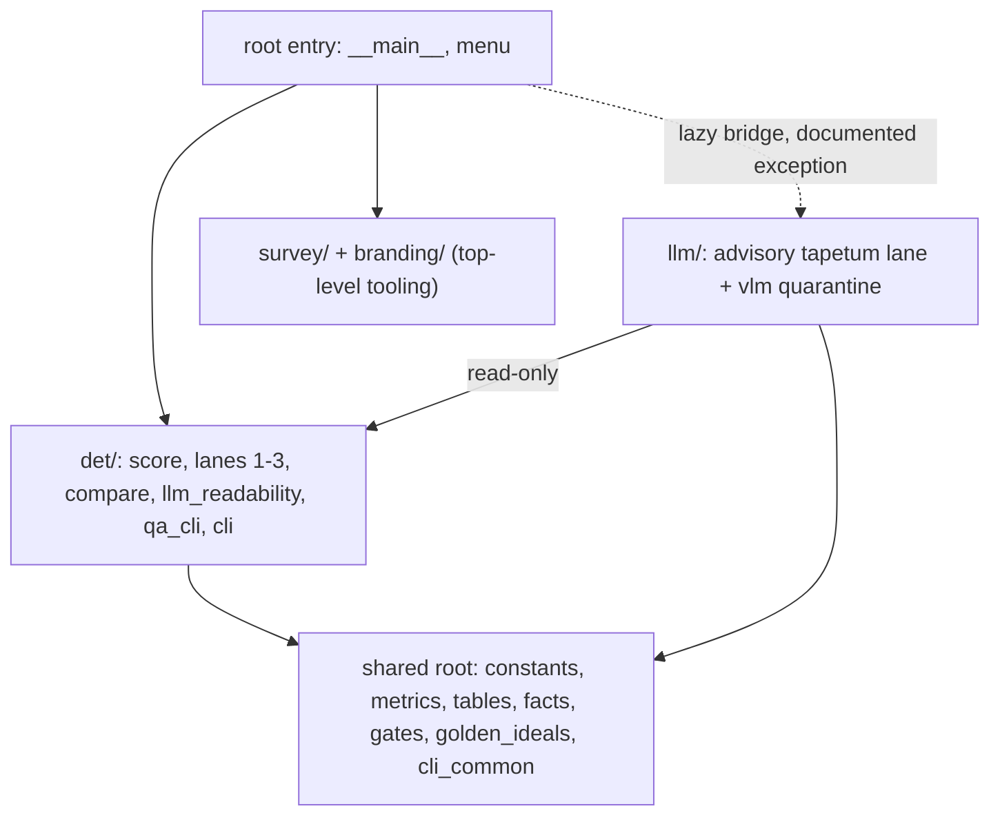

# Whisker Lane Restructure (det/ + llm/ + shared root)

## Product Requirements

- Problem and users: `src/whisker/` mixes 29 flat modules + 5 subpackages with no lane boundary visible on disk; a new developer cannot tell deterministic core from advisory LLM lane from shared plumbing. Users: maintainers of whisker and agents working on it.
- Goals: one folder per lane (`det/`, `llm/`); genuinely shared modules stay at `src/whisker/` root; structure readable from `src/whisker/CLAUDE.md` alone; dead code verified and eliminated; `research/` organized into `plans/` + `research/`.
- Non-goals: no behavior change (CLI verbs, console script names, exit codes, on-disk artifact layout `WG21_DATA_DIR/whisker/det|llm`, sidecar filenames, the `tapetum-llm` extra name all unchanged); no edits to other packages' source (preview/tomd/pipeline untouched); no function-level dead-code audit; no rewriting of historical doc prose.
- Success criteria: full whisker test suite green; root import-linter green; wheel builds with all package data; three console scripts smoke-pass; optional one-paper live pod run proves alliance-pod wiring.
- Constraints: whisker boundary rule — only `packages/whisker/` files plus two flagged repo-root config exceptions (below); git mv for all moves (history preserved); deletions limited to verified-dead artifacts (none found at module level).
- Open questions: None.

## Functional Specification

- Actors and workflows: operators running `whisker` / `whisker-tapetum-llm` / `whisker-readback` (unchanged verbs and flags); developers navigating source; CI running `packages/whisker/tests` + import-linter.
- Inputs and outputs: identical to today — sidecars, reports, exit codes, JSON schemas, fingerprint keys, `_LANE_VERSION` all untouched.
- States and validation: the one-way dependency rule is restated as: `llm/` may import shared root + `det/` read-only; `det/` and shared root never import `llm/`; enforced by import-linter contracts (updated paths) and `tests/test_import_contracts.py` (updated module sets).
- Errors and recovery: any missed import rewrite surfaces as ImportError at test collection — the full suite is the net.
- Security and privacy behavior: prompt-injection controls unchanged; `tests/test_tool_privilege.py` and `tests/test_vlm_lane.py` guards updated to new paths, never weakened.
- Acceptance criteria: every command in `packages/whisker/README.md` behaves byte-identically; `whisker delta` baselines unaffected (artifact paths unchanged).

## Technical Design

- Architecture (import direction, enforced by import-linter):

- Target layout under `packages/whisker/src/whisker/`:
  - Shared root (stays): `__init__.py`, `__main__.py` (slimmed to dispatcher), `constants.py`, `metrics.py`, `tables.py`, `facts.py`, `gates.py`, `golden_ideals.py`, `menu.py`, new `cli_common.py`, `py.typed`, `CLAUDE.md`. Sharing proven by import evidence: the llm lane imports exactly these (plus `det.score` verdicts/paths and `det.llm_readability`).
  - `det/` (new): `anchors, bench, calibrate, canonical, code_fence_align, corpus_tools, delta, golden, golden_compare, golden_gaps, golden_qa, guard, match, paragraph_align, pdf_geometry, probe_strength, qa_cli, reference, report, score, structural` + `compare/` (from root) + `llm_readability/` (from root) + new `det/cli.py` (verb bodies extracted from `__main__.py`).
  - `llm/` (renamed from `tapetum_llm/`): all 24 modules + `vlm/` quarantine intact; authority doc `tapetum_llm.md` renamed `llm/llm.md` (follows the package-named pipeline-markdown convention).
  - `survey/`, `branding/` stay top-level (cross-lane tooling; user decision).
- Shared-root refactors (the "shared files need refactoring" item):
  - `gates.py`: promote `_iter_body_lines` / `_split_front_matter` to public — `llm/toc_leak.py` already consumes them (today: private cross-lane import).
  - New `cli_common.py`: `render_progress` (today `llm/cli.py` imports private `_render_progress` from `__main__`), plus shared backend-open and verdict-exit helpers.
  - `__main__.py`: verb bodies (`_score_main`, `_bench_main`, `_guard_main`, `_golden_main`, `_facts_main`, `_delta_main`, `_calibrate_main`, `_corpus_main`, `_score_file_main`, `_check_facts_main` + helpers) move to `det/cli.py`; `__main__` keeps only dispatch + the docstring contract.
  - `__init__.py`: re-export paths updated; every public name stays importable as `from whisker import X` (absorbs the move for benchmark tools and flat-API tests).
- External contracts preserved: console script names and the `tapetum-llm` extra name unchanged in [pyproject.toml](packages/whisker/pyproject.toml) (only module paths `whisker.tapetum_llm.cli` -> `whisker.llm.cli`, `whisker.tapetum_llm.readback_cli` -> `whisker.llm.readback_cli`); sidecar/artifact names unchanged (`packages/preview` mirrors them read-only); `python -m whisker.compare.cli` becomes `python -m whisker.det.compare.cli` with docs updated.
- Repo-root exceptions (REQUIRE USER APPROVAL via this plan seal, per boundary rule): root `pyproject.toml` import-linter contracts (`whisker.tapetum_llm` -> `whisker.llm`; source_modules updated to `whisker.det.*` paths); any lint-exclude referencing `packages/whisker/research/...` if a moved path is named there (repos/ stays put precisely to minimize this).
- Dead-code finding (evidence: full import graph): zero statically dead modules. Kept placeholders, documented: `llm/vlm/` (quarantined Vision Pod upgrade, guard test), `det/compare/cli.py` (documented `python -m` entry), `corpus/calibration/` tooling (pending calibration feature), `facts.auto_baseline_checks` (known gap #12). Stale `__pycache__` fossils (`admission`, `payload_scope`) are untracked build artifacts; no action.
- Research reorg: `research/plans/` (new; receives `whisker-llm-lane4-plan.md` + a copy of this sealed plan as `2026-09-07-whisker-restructure.md`); `research/research/` receives the 27 topic dirs + 8 loose reports + the 4 `notes/` files (`notes/` dir removed by the move); `research/repos/` and `.gitignore` stay at `research/` root (lint-exclude path stability; clone cache, not a document). External references updated: `llm/constants.py` (1), `llm/pdf_judge.py` (3), `tests/test_pdf_judge.py` (1), `det/llm_readability/deepseek-v4/tables/rules.toml` (1), `src/whisker/CLAUDE.md` (4). Intra-research historical prose cross-references are not rewritten (same doctrine as CHANGELOG).
- Docs: `src/whisker/CLAUDE.md` architecture map + module layout fully rewritten to the new tree (the "instant understanding" deliverable); `README.md` path touches; `CHANGELOG.md` gets one new entry (history untouched); `FIXPATH-REPORT.md` gets a one-line header noting paths predate the 2026-09 restructure.

## Testing Plan

- Unit: `uv run --package whisker pytest packages/whisker/tests` — all 79 files green after mechanical import rewrites; tests refiled into `tests/det/`, `tests/llm/`, `tests/` root (shared/contracts) mirroring src.
- Contract guards updated, never weakened: `test_import_contracts.py` (new module paths in both forbidden-contracts), `test_tool_privilege.py`, `test_vlm_lane.py` (vlm quarantine + pipeline text-only signature), `test_score_pinning.py`.
- Integration and end-to-end: root `uv run pytest` (whisker in testpaths) + `uv run lint-imports` green; hermetic Lane 3 gate `tests/test_comprehension_corpus.py` passes with no `WG21_DATA_DIR`; `uv build --package whisker` proves hatch still ships `det/llm_readability/deepseek-v4` data, survey locks, branding assets (packaged-resource tests).
- Pod connectivity: all pod tests are mocked (zero live tests exist); wiring preserved at the four resolver sites (`llm/cli.py` health probe, `llm/readback_cli.py::_resolve_service`, `llm/unit_judge.py` creds, `llm/adjudicate.py` `load_services`). Optional live smoke at user discretion: one-paper `whisker-tapetum-llm` run or `WHISKER_LLM_EVAL=1 uv run --package whisker pytest packages/whisker/tests/test_tapetum_llm_eval.py`.
- Regression: CLI smoke of all three console scripts (`--help` + one no-write scoring call); `whisker delta` reads pre-refactor `report.prev.json` unchanged.
- Exit criteria: every box above green (live pod smoke optional, user-gated).

## Decision Record

- Decisions:
  - Lane folders named `det/` + `llm/` — mirrors the `WG21_DATA_DIR/whisker/det|llm` artifact dirs; user's selection, requested as "a folder for llm and one for determinstic".
  - `llm_readability/` + `compare/` file under `det/` (both pure deterministic); `survey/` + `branding/` stay top-level — user's selection.
  - Shared root = exactly the modules the llm lane imports (`constants, metrics, tables, facts, gates, golden_ideals`) + entry/plumbing — evidence-based, from the full import graph.
  - `llm/` may import `det/` read-only (e.g. `det.score` verdicts, `det.llm_readability`) — preserves today's one-way isolation, direction restated.
  - Root entry (`__main__.py` / `menu.py`) reaches `llm/` only through a deferred, function-local import — the "lazy bridge, documented exception" edge in the architecture diagram. Import-linter contracts forbid static root→llm imports, so this bridge is the single sanctioned crossing and the only place new entry-to-llm dispatch may be added. Hard to reverse: a static alternative either violates the one-way lane rule or forces a dispatch inversion (llm registering verbs upward), and proliferating ad-hoc lazy imports would defeat the contract.
  - Tapetum brand preserved in console script (`whisker-tapetum-llm`), extra name, and sidecar filenames (external contracts); only the Python package renames to `whisker.llm`.
  - `__main__.py` slimmed to a dispatcher with verb bodies in `det/cli.py` — serves "maintenance must be easy"; 1,900-line entry module is the disorder.
  - Root import-linter `source_modules` includes new `whisker.cli_common` and `whisker.det.cli` modules — boundary enforcement must cover newly extracted modules, not only their predecessors. Falsifier: import-linter gains package-pattern coverage that automatically includes every module under the deterministic and shared-root namespaces.
  - Historical docs (CHANGELOG entries, FIXPATH-REPORT, research prose) not rewritten; pointer headers instead — rewriting dated history falsifies it.
  - `notes/` folds into `research/research/`; `repos/` stays at `research/` root.
- Rejected alternatives:
  - Splitting `score.py` into shared verdicts + det scoring — unnecessary churn once llm->det imports are sanctioned; revisit only if the dependency direction ever needs reversing (doctrine says never).
  - Moving `repos/` under `research/research/` — breaks lint-exclude path stability for a 141k-file untracked clone cache; revisit if lint config moves into the package.
  - Renaming console scripts/extra/sidecars to drop "tapetum" — external contracts (preview mirrors sidecar names); not revisitable.
  - Deleting `compare/cli.py` as dead — it is the documented `python -m` benchmark entry; soft entry, not orphan.
- Assumptions, risks, and notes:
  - Root `pyproject.toml` edits (import-linter, possibly lint-exclude) are outside `packages/whisker/`; approved by sealing this plan.
  - `corpus/calibration/test_*.py` already live outside CI collection (pre-existing); not changed by this refactor.
  - benchmark/tools (~25 scripts) import whisker module paths and are updated in the same sweep (in-package).
  - No live pod test exists to break; the optional live smoke is the only pod proof and is user-gated.

## Project survey

Surveyed 2026-09-07 against the repository root. `vibe/archdoc.md` does not exist (no `vibe/` directory; first run), so the component map below is built from `pyproject.toml` evidence and CI configuration.

- Build command: `uv sync --all-packages` syncs the uv workspace (CI: `uv sync --all-packages --all-extras --group dev` for the lint job). Root project is `package = false` (aggregator, not built). Per-package wheel build: `uv build --package <name>` (e.g. `uv build --package whisker`); all packages use the hatchling backend with `src/` layout.
- Focused test command pattern: `uv run pytest packages/<package>/tests` (CI matrix form); root CLAUDE.md also documents `uv run --package <name> pytest`. Single integration file: `uv run pytest tests/test_end_to_end_convert.py`.
- Full-suite test command: `uv run pytest` from the repo root. `testpaths` in root `pyproject.toml` covers all 10 package `tests/` dirs plus the root `tests/` dir; `addopts = "-m 'not network'"` deselects network-marked tests by default.
- Linter and formatter: `uv run ruff check packages tests` (CI lint job; ruff pinned `~=0.6` in the dev group; `extend-exclude = ["packages/whisker/research/repos"]`). No formatter command is wired: no `[tool.ruff.format]` section, no pre-commit config, CI runs `ruff check` only. Typecheck: `uv run pyright packages` (CI job, `continue-on-error: true`; basic mode, tests excluded). Import contracts: `uv run lint-imports` (import-linter, two `forbidden` contracts on `whisker` in root `pyproject.toml`).
- Test placement and naming: per-package `packages/<name>/tests/test_*.py` with fixtures under `packages/<name>/tests/fixtures/`; cross-package integration tests in root `tests/` (`test_end_to_end_convert.py`, `test_assay_capability_validation.py`). whisker has 79 `test_*.py` files flat under `packages/whisker/tests/`. Custom marker: `network` (deselected by default).
- Directory map (top level): `packages/` — the 10 uv workspace members (below); `tests/` — cross-package integration tests; `.github/workflows/` — `tests.yml` (lint, pyright, per-package test matrix on ubuntu+windows, integration) and `notify-superproject-vendor-pin.yml`; `study/` — study scripts (production packages never import from it); `data/`, `html/`, `herald/`, `dist/` — data/build output dirs; `_inbox/`, `_output/`, `_research/`, `_scratch/`, `_trash/` — cabinet filing dirs; root docs and config — `CLAUDE.md`, `MODELS.md`, `SERVICES.toml`, `ARCHITECTURE.md`, `DESIGN.md`, `CONTEXT.md`, `README.md`, `justfile` (command hub, mounts `packages/tomd/justfile` as a module), `pyproject.toml`, `uv.lock`.
- Component boundaries (workspace dependencies, from each package's `pyproject.toml`): `paperstore` — storage abstraction, no workspace deps (base layer). `mailing` -> paperstore. `tomd` -> paperstore. `pipeline` — LLM pipeline framework, no workspace deps. `agora` -> paperstore, pipeline. `assay` -> paperstore, pipeline. `cli` -> paperstore, mailing, tomd, pipeline, agora, assay (the top of the ingestion stack). `preview` -> paperstore. `cpp-mcp` — no workspace deps. `whisker` -> paperstore, tomd; `pipeline` only via the optional `tapetum-llm` extra. Enforced one-way rule inside whisker (import-linter): the deterministic core modules and the `llm_readability`, `branding`, `compare`, `survey` subpackages must not import `whisker.tapetum_llm` or `pipeline`.
- Conventions summary: uv monorepo, `packages/<name>/src/<name>/` src-layout, hatchling builds, Python >= 3.12, BSL-1.0 license headers on new files. `__init__.py` carries re-exports only; logic lives in named modules. No lazy imports in production packages. Storage only through `paperstore.StorageBackend`; library functions return data, callers (CLI) persist. `logging`, never `print()` (only `cli` writes to stderr). Tunable thresholds are named module-level constants. LLM pipelines follow determinism rules D1-D11 (serial execution default, `run_agent`/`run_task` only, structured `output_type` with retry budgets, sorted collections into prompts). No em dashes in prose. Package-specific rules live in `packages/<name>/src/<name>/CLAUDE.md`.
- Rules manifest (no `AGENTS.md` exists anywhere in the repo; CLAUDE.md files serve as the rules manifest):
  - `CLAUDE.md` — governs the entire repo (project-wide rules, invariants, determinism, fidelity).
  - `packages/paperstore/src/paperstore/CLAUDE.md` — governs `packages/paperstore/`.
  - `packages/mailing/src/mailing/CLAUDE.md` — governs `packages/mailing/`.
  - `packages/tomd/src/tomd/CLAUDE.md` — governs `packages/tomd/`.
  - `packages/pipeline/src/pipeline/CLAUDE.md` — governs `packages/pipeline/`.
  - `packages/whisker/src/whisker/CLAUDE.md` — governs `packages/whisker/` (the package under surgery; its architecture map is rewritten in Step 6).
  - `packages/agora/src/agora/CLAUDE.md` — governs `packages/agora/`.
  - `packages/assay/src/assay/CLAUDE.md` — governs `packages/assay/`.
  - `packages/cpp-mcp/src/cpp_mcp/CLAUDE.md` — governs `packages/cpp-mcp/`.
  - `packages/cli/` and `packages/preview/` have no CLAUDE.md; they fall under the root file only.

## Execution Instructions

Components (dependency order; a part is high-level when it stands alone and ships as a unit):

1. Lane package moves (`llm/` rename, then `det/` move) — the foundation; every later part references final module paths, so it lands first. `llm/` before `det/`: the rename touches only `tapetum_llm` references, while the det move must rewrite llm-internal imports (`whisker.score` -> `whisker.det.score`), which is possible in one pass only once `llm/` exists at its final name.
2. Shared-root refactors (`gates.py` helpers, `cli_common.py`, `det/cli.py`, slim `__main__.py`) — needs the lanes in place: `det/cli.py` cannot exist before `det/`, and `cli_common.py`'s consumer `llm/cli.py` must sit at its final path.
3. Test refile (`tests/det/`, `tests/llm/`, root) — needs final module paths settled so each test file moves exactly once. Import rewrites that keep the suite green ride inside the move commits; this part is the physical relocation only.
4. Research reorg (`research/plans/` + `research/research/`) — directory moves are independent of code, but the reference sweep names post-move paths (`llm/constants.py`, `det/llm_readability/...`), so it runs after the moves to avoid double rewriting.
5. Docs and verification battery — describes the settled tree and gates the result; last.

Piece assembly: components 1-3 are strictly sequential (hard path dependencies). Component 4's directory moves could run in parallel with 1-3, but its reference sweep cannot; kept serial so every commit ends green. The skeleton work item folds into Steps 1-2: an empty lane package has no testable behavior on its own, so each `__init__.py` lands in the same commit as the move that populates it. Config updates (whisker pyproject script paths, root import-linter contracts) ride inside the move commit that necessitates them — a rename without the entry-point and contract update leaves console scripts and lint-imports broken. Each step below is one commit carrying its code and its tests; `uv run --package whisker pytest packages/whisker/tests` and `uv run lint-imports` must be green at the end of every step before the next begins.

### Step 1: Rename tapetum_llm to llm [completed]
- `git mv src/whisker/tapetum_llm src/whisker/llm` (all 24 modules + `vlm/` quarantine intact); rename authority doc `llm/tapetum_llm.md` -> `llm/llm.md`.
- Rewrite `whisker.tapetum_llm` -> `whisker.llm` repo-wide: `__main__.py`, `__init__.py`, menu dispatch, tests, benchmark/tools (~25 scripts), living docs.
- `packages/whisker/pyproject.toml`: script module paths `whisker.tapetum_llm.cli` -> `whisker.llm.cli` and `whisker.tapetum_llm.readback_cli` -> `whisker.llm.readback_cli`; script names (`whisker-tapetum-llm`, `whisker-readback`) and the `tapetum-llm` extra unchanged.
- Root `pyproject.toml` import-linter: `whisker.tapetum_llm` -> `whisker.llm` in `forbidden_modules` (flagged exception, pre-approved by plan seal).
- `tests/test_import_contracts.py`: llm module set updated to `whisker.llm*`.
- Verify: full suite + lint-imports green; `whisker-tapetum-llm --help` and `whisker-readback --help` smoke-pass.

### Step 2: Move deterministic lane into det/ [completed]
- Create `src/whisker/det/__init__.py` (re-exports only, BSL header); `git mv` the 21 modules (`anchors, bench, calibrate, canonical, code_fence_align, corpus_tools, delta, golden, golden_compare, golden_gaps, golden_qa, guard, match, paragraph_align, pdf_geometry, probe_strength, qa_cli, reference, report, score, structural`) plus `compare/` and `llm_readability/` into `det/`.
- Rewrite imports repo-wide: `__main__.py`, `__init__.py`, llm modules (`whisker.score` -> `whisker.det.score`, `whisker.llm_readability` -> `whisker.det.llm_readability`), tests, benchmark tools.
- Root `pyproject.toml` import-linter: `source_modules` updated to `whisker.det.*` paths (flagged exception).
- `tests/test_import_contracts.py` det module set, `test_tool_privilege.py`, `test_vlm_lane.py` path references updated; guards never weakened.
- Verify: full suite + lint-imports green; `whisker --help` and `python -m whisker.det.compare.cli --help` smoke-pass.

### Step 3: Shared-root refactors [completed]
- `gates.py`: promote `_iter_body_lines` / `_split_front_matter` to public names; update consumer `llm/toc_leak.py`.
- New `src/whisker/cli_common.py`: `render_progress` (replaces `__main__._render_progress`, consumed by `llm/cli.py`), shared backend-open and verdict-exit helpers.
- Extract verb bodies from `__main__.py` into new `src/whisker/det/cli.py`: `_score_main`, `_bench_main`, `_guard_main`, `_golden_main`, `_facts_main`, `_delta_main`, `_calibrate_main`, `_corpus_main`, `_score_file_main`, `_check_facts_main` + helpers; `__main__.py` slimmed to dispatch + the docstring contract.
- `src/whisker/__init__.py`: re-export paths updated; every public name still importable as `from whisker import X`.
- Root `pyproject.toml`: add `whisker.cli_common` and `whisker.det.cli` to both import-linter `source_modules` lists so the extracted modules remain covered (narrow repo-root exception authorized by the Decision Record).
- Verify: full suite green (flat-API tests absorb the move); all three console scripts smoke-pass.

### Step 4: Refile tests to mirror lanes [completed]
- `git mv` test files into `tests/det/`, `tests/llm/`, and `tests/` root (shared/contract tests); adjust any conftest path logic; test collection count unchanged.
- Verify: full suite green; `test_score_pinning.py` and the contract guards pass at their new locations.

### Step 5: Research reorg
- Create `research/plans/` and `research/research/`; `git mv` the 27 topic dirs + 8 loose reports + the 4 `notes/` files into `research/research/` (`notes/` removed by the move), `whisker-llm-lane4-plan.md` into `research/plans/`; copy this sealed plan to `research/plans/2026-09-07-whisker-restructure.md`.
- `research/repos/` and `research/.gitignore` stay at `research/` root (lint-exclude path stability).
- Sweep references: `llm/constants.py` (1), `llm/pdf_judge.py` (3), `tests/test_pdf_judge.py` (1), `det/llm_readability/deepseek-v4/tables/rules.toml` (1), `src/whisker/CLAUDE.md` (4). Historical prose cross-references not rewritten.
- Verify: full suite + lint-imports green.

### Step 6: Docs and verification battery
- Rewrite `src/whisker/CLAUDE.md` architecture map + module layout to the new tree; `README.md` path touches; one new `CHANGELOG.md` entry; `FIXPATH-REPORT.md` one-line pointer header.
- Run the battery: full whisker suite, root `uv run pytest`, `uv run lint-imports`, `uv build --package whisker` (package-data tests prove `det/llm_readability/deepseek-v4` data, survey locks, branding assets ship), three-script CLI smoke (`--help` + one no-write scoring call), `whisker delta` reading a pre-refactor `report.prev.json`, hermetic `tests/test_comprehension_corpus.py` with no `WG21_DATA_DIR`.
- Optional, user-gated: one-paper live `whisker-tapetum-llm` pod run or `WHISKER_LLM_EVAL=1 uv run --package whisker pytest packages/whisker/tests/test_tapetum_llm_eval.py`.

Deferred and out of scope: function-level dead-code audit; corpus/calibration CI inclusion; intra-research prose cross-ref rewrite; any edit to preview/tomd/pipeline source; live pod smoke (user-gated optional).