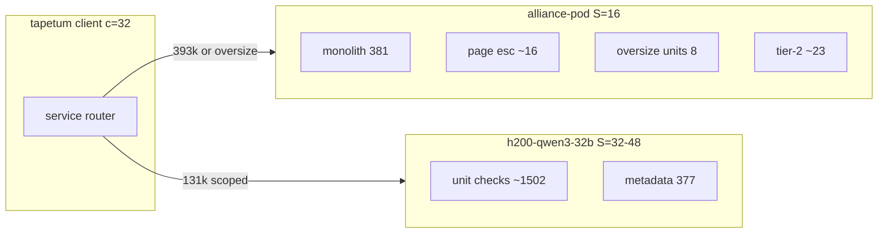

# 12 - Dense Offload Architecture (single MoE pod)

**Verdict:** usable-with-conditions — route **1887/2284 (82.6%)** of tapetum LLM calls to `h200-qwen3-32b`, keep **397 calls** on `alliance-pod`, and treat heterogeneous wall as **`max(T_dense, T_moe)`**; at **2× unit decode** with payload scoping landed, estimated cold wall **~510–710 s** (MoE-bound), which closes most of the single-pod gap but **does not reliably hit ≤600 s** without MODERATE call cuts and remains **quality-blocked** until 381/381 A/B parity.

**Confidence:** medium (throughput from personas 23/105; quality unproven)

**Date:** 2026-07-24. Sources: `research/cold-run-10min/16-dense-judge-candidates.md`, `research/tapetum-llm-speedup/{23-small-judge-evaluator,105-vllm-dense-judge-throughput}.md`, `research/cold-run-10min-1pod/00-baseline.md`, `research/cold-run-10min/{20-payload-scoping-auditor,25-quality-gate-protocol,49-monolith-keep}.md`, `SERVICES.toml`.

---

## Constraint recap

| Rule | Implication |
|------|-------------|
| **No second V4-Pro** | `h200x8-deepseek-v4-pro` is blocked (`cold-run-10min-1pod/00-baseline.md`, `15-dual-pod-liveness.md`). `alliance-pod` stays the sole MoE lane at **S=16**. |
| **Dense pods ≠ second pod** | Offload to **already-running** open-weight endpoints in `SERVICES.toml` is in scope; identical DeepSeek replica is not. |
| **S_eff = 16 on alliance-pod** | No MoE `--max-num-seqs 32` (+57% wall measured). Dense pod may run **S=32–48** independently. |
| **Quality-stability** | Judge swap changes lane semantics; full-fleet revalidation before `_LANE_VERSION` bump. |

---

## Recommended routing split

### Primary assignment

| Call class | Count | Pod | Service | Rationale |
|------------|------:|-----|---------|-----------|
| PDF monolith | 181 | MoE | `alliance-pod` | Full PDF text + full md; **393216** context only on MoE (`49-monolith-keep.md`). Sole document-wide reorder lens; **7.5% wall**, not droppable. |
| HTML tier-1 triage | 201 | MoE | `alliance-pod` | Full-doc role; same context requirement as monolith class. |
| HTML tier-2 adjudicate | ~23 | MoE | `alliance-pod` | Full md after tier-1; tiny volume. |
| Page escalation | ~16 | MoE | `alliance-pod` | One page + full md; **0.7%** of calls; same 393k budget for oversize papers. |
| Unit check (in-budget) | **~1502** | Dense | **`h200-qwen3-32b`** | **66%** of fleet calls; 131k fits **373/381** papers (`23-small-judge-evaluator.md`). |
| Unit check (oversize fallback) | **8** | MoE | `alliance-pod` | Exceed 131k × 0.80 safety margin; mandatory MoE fallback (`23`, `105`). |
| Metadata / outline | **377** | Dense | **`h200-qwen3-32b`** | Bounded payload (`unit_judge.py:241-256`); fits 131k with large headroom; same quality gate as units (`23`). |
| Ideal verify | ~1 | MoE | `alliance-pod` | Negligible wall; full-doc both sides. |

**MoE total:** ~**428–432** calls (**18.8%** of fleet).  
**Dense total:** ~**1879** calls (**82.3%** of fleet).

### Reserve / do-not-use-as-primary

| Service | Role | Why not default |
|---------|------|-----------------|
| `b300-qwen36-27b` | Pilot #2 after A/B | Smallest live dense; **≥2× decode hypothesis** but **higher false-clear risk** (`16-dense-judge-candidates.md`). Promote only if bench shows **L_unit ≤8 s** at S=48 **and** 381/381 parity. |
| `b200x2-gemma4` | Avoid for unit lane | Only live dense with `tools_capable = true`; persona **23 false-fail** on `:::wording-remove` / `<del>` markup. |
| `b200-r1` | Avoid | 70B + thinking blocks; **≤1.5× decode hypothesis**, no throughput persona (`16`). |

### Explicitly NOT moved off MoE

- **381 first-pass** (monolith + HTML tier-1): structural whole-doc comparison.
- **8 oversize unit fallbacks**: hard context ceiling.
- **Page escalations**: full md + 393k headroom for tail papers.
- **Deterministic metadata diff** (AGGRESSIVE): replaces the **377 metadata LLM calls** on MoE/dense entirely once A/B-gated; orthogonal to dense unit offload (`49-monolith-keep.md`, `17-metadata-shortcircuit-design.md`).

---

## Architecture diagram

**Scheduling rule (persona 105):** client maintains **per-pod `Semaphore(16)`** on MoE and **per-pod `Semaphore(32–48)`** on dense; fleet wall = **`max(T_dense, T_moe)`**, not sum.

---

## Payload scoping blocker

**Status:** NOT landed. **Blocks dense S≥32 and 2× decode assumptions.**

| Today | Required for dense EV |
|-------|----------------------|
| Unit checks send **full `candidate_md`** every call (`unit_judge.py:769-776`, `20-payload-scoping-auditor.md`) | Scoped **~10–15k tokens**: H2 window ±1 neighbor + presence index; grounding stays on full doc post-hoc |
| p95 markdown **~134k chars** (~50k tok) | Keeps **373/381** in 131k budget without KV saturation |
| Dense pod at full md: **S≤16**, **L≈20 s** → **T_dense ≈ 2349 s** | Dense at scoped + FP8 KV: **S=32–48**, **L=8–12 s** (`105`, `16`) |

**Without scoping:** offload is **negative EV** — dense leg reverts to MoE-class latency while adding router complexity and unvalidated quality (`105` false-pass: "64 slots provisioned" but preemption keeps **L≥20 s**).

**Portable design (from persona 20):** hybrid window + mechanical ANYWHERE presence index; `verify_unit_evidence` unchanged on full `raw_tomd_md`. Estimated prefill-only savings **~198 s (~7%)** even with scoping; scoping's main job here is **KV headroom for S=48**, not primary wall cut.

**Landing order:** scoping **before** `_LANE_VERSION` bump for dense judge; bench at **12k/256** prompt shape after scoping (`105` validation #2).

---

## Quality gate requirements

Dense offload is a **semantic lane change**, not scheduling-only. Gates below extend `25-quality-gate-protocol.md` and persona **23/105**.

### Hard ship blockers (all required)

| Gate | Criterion | Source |
|------|-----------|--------|
| **381/381 fused verdict parity** | Identical `suggested_verdict` + `fusion.combined_verdict` vs `alliance-pod` baseline on full fleet | `23`, `105` |
| **Verdict-changing paper match** | On all **16/381** papers where LLM findings changed merged verdict: matching `defect_groups` + `evidence_dispositions` | `23`, `00-baseline.md` |
| **Zero-defect cohort audit** | Log disagreements on **1057/1510** zero-defect unit checks for silent **false-clear** (P0957R8 class) | `23` |
| **MoE fallback correctness** | **8/381** oversize papers route to `alliance-pod`; no truncate-and-run on dense | `23` |
| **`_LANE_VERSION` bump** | Fingerprint binds service + model; swap without bump poisons incremental skip (`cli.py:99-117`) | `23` |
| **A/A noise floor first** | `flip_AB ≤ flip_AA + margin` on four-component equivalence vector (`25-quality-gate-protocol.md` §1) | `25`, `47-quality-equivalence` |
| **Dev-replay recall** | `recall_B ≥ recall_A − 0.05` on 9 golden PRs / 29 defect groups | `25` |
| **Holdout anchors** | 48 anchors on 3 papers non-regressing | `25` |

### Equivalence vector (per PID, all four must match)

1. `suggested_verdict`
2. `fusion.combined_verdict`
3. Defect-group multiset keyed by `defect_type`
4. Coverage tuple `(coverage_complete, unchecked_unit_ids, failed_unit_ids, checked_count, mode, all_pages_requested)`

**Not sufficient:** SLMJury ~90% oracle agreement (`23`); ~90% still misses verdict-changing papers when only **16/381** flip at all.

### Validation protocol (minimum)

1. Payload scoping landed.
2. `vllm bench serve` on `h200-qwen3-32b` vs `alliance-pod` at **12k/256** and **40k/900** (`105`).
3. Pilot A/B: unit + metadata on dense, monolith on MoE, **381 papers**, persona-47 worksheet (`16` recommended order #3).
4. If parity holds, optional **`b300-qwen36-27b`** bench for incremental decode before any Gemma trial.

### Bundling note

Dense offload **must not** ship in the same `_LANE_VERSION` as metadata short-circuit or HMAC reorder without a bundled B run (`25` §4.1). For attribution, prefer isolated B (+50 min) when a gate fails.

---

## Wall arithmetic: 2× decode on units

**Baseline:** **3003 s** single-pod, **2284 calls**, **L=20 s**, **S=16** (`00-baseline.md`, `11-wall-arithmetic.md`).

**Persona 23 proportional model:** 2× unit decode → **L_unit = 10 s** (20 → 10). Metadata at similar ratio → **L_meta ≈ 5 s** (bounded payload, faster than units).

**Persona 105 heterogeneous model:** parallel pods → **`wall = max(T_dense, T_moe) + T_client`**.

Assumptions for the table below:

- Payload scoping **landed** (12k effective tokens).
- Dense pod: **`h200-qwen3-32b`**, **S=48**, **FP8 KV**, `--enable-prefix-caching`.
- MoE pod: **`alliance-pod`**, **S=16** fixed.
- Monolith **L_mono = 19 s**; page/oversize **L = 20 s**.

### Scenario A — dense offload only (no metadata short-circuit)

| Leg | Calls | L (2× assumption) | S | Wall (s) |
|-----|------:|------------------:|--:|---------:|
| Dense: units | 1502 | 10 s | 48 | 313 |
| Dense: metadata | 377 | 5 s | 48 | 39 |
| **T_dense** | 1879 | — | — | **~352** |
| MoE: monolith + tier-2 + esc + oversize | ~428 | 19–20 s | 16 | **~511** |
| **Fleet (parallel)** | — | — | — | **~511** |

**MoE-bound.** Dense 2× saves **~1536 s** vs putting units on the same queue, but **monolith queue sets wall**.

### Scenario B — 2× decode on units only (metadata stays on MoE at 20 s)

| Leg | Wall (s) |
|-----|----------:|
| T_dense (units only, 1502×10/48) | ~313 |
| T_moe (758 monolith+metadata + esc + oversize, persona 105 formula) | **~620–710** |
| **Fleet** | **~620–710** |

Matches persona **105** central band when metadata remains on MoE at baseline latency.

### Scenario C — dense offload + MODERATE metadata short-circuit (Tier A+B)

| Leg | Calls | L | S | Wall (s) |
|-----|------:|--:|--:|---------:|
| Dense: units (survivors) | 663 | 10 s | 48 | 138 |
| Dense: metadata | 377 | 5 s | 48 | 39 |
| **T_dense** | 1040 | — | — | **~177** |
| MoE: monolith + esc + oversize | ~428 | 19–20 s | 16 | **~511** |
| **Fleet** | — | — | — | **~511** |

Short-circuit removes **847** unit calls from dense/MoE queues but **does not shrink monolith term**; wall stays **MoE-bound ~511 s** until **L_mono** or **N_mono** drops.

### Scenario D — scoping NOT landed (blocker active)

| Leg | L | S | T_dense (1879 calls) |
|-----|--:|--:|---------------------:|
| Full-md dense | 20 s | 16 | **~2349 s** |

Even with MoE at ~511 s, **client or dense saturation** can inflate observed wall; persona **105** tags this **`NEGATIVE-EV-WITHOUT-SCOPE`**.

### Savings vs single-pod baseline (Scenario A)

| Metric | Value |
|--------|------:|
| Baseline (all on alliance-pod) | 3003 s |
| Heterogeneous dense offload (2× units, scoped) | **~511 s** |
| **Δ wall** | **~−2492 s (~83%)** |
| vs ≤600 s target | **Inside band** if MoE stays ≤511 s; **no margin** for +75 s skew friction or unscoped regression |

**Persona 23 fleet-level save (single-queue model):** **~850–1200 s** at 2–2.5× — conservative because it does not use **`max()`** parallelism. Persona **105** supersedes for heterogeneous layout: **~2300 s** saved vs baseline, but **620–710 s** if metadata stays on MoE at baseline **L**.

### 2.5× sensitivity (L_unit = 8 s, L_meta = 4 s, Scenario A)

| Leg | Wall (s) |
|-----|----------:|
| T_dense | **~282** |
| T_moe | **~511** (unchanged) |
| **Fleet** | **~511** |

**Conclusion:** at 2×–2.5× unit decode, **MoE monolith tier dominates**; further cuts require metadata deterministic diff (−377 MoE calls, **~471 s** class), prefix/APC on monolith, or verdict-first on survivors — not faster dense alone.

---

## Recommended implementation sequence

1. **Payload scoping** (unblocks S=48 KV math).
2. **Service router** in tapetum: map call class → `{alliance-pod, h200-qwen3-32b}`; oversize preflight from token estimator (`23`).
3. **Dense pod vLLM recipe** (delta from MoE): `--max-num-seqs 48`, `--kv-cache-dtype fp8`, `--enable-prefix-caching`, `--max-num-batched-tokens 16384` (`105`).
4. **`vllm bench serve`** at production shapes.
5. **381-paper A/B** with gates in §Quality gate.
6. **`_LANE_VERSION` bump** + cold rerun on pass.
7. Optional: **`b300-qwen36-27b`** if step 5 passes and step 4 shows headroom.

---

## Risk register (from `16-dense-judge-candidates.md`)

| Tag | Mitigation |
|-----|------------|
| `PAYLOAD-SCOPE-BLOCKER` | Do not enable dense routing until scoping ships |
| `QUALITY-UNVALIDATED` / `AB-GATE-381` | Full A/B before bump |
| `MOE-FALLBACK-8` | Token preflight → route oversize to `alliance-pod` |
| `FALSE-CLEAR` | Audit zero-defect disagreements; P0957R8 replay |
| `FALSE-FAIL-WORDING` | Avoid Gemma primary; keep wording papers in A/B holdout |
| `LANE-VERSION-BUMP` | Mandatory on any default service change |

---

## False-pass / false-fail

**False-pass:** Ship dense at S=64 without FP8 KV or scoping; preemption keeps **L_unit ≥ 20 s**; operators see "82% calls offloaded" but wall **>15 min** (`105`).

**False-fail:** Reject dense because single-pod MODERATE is **~1493 s** (`00-baseline.md`) — that arithmetic keeps **all 2284 calls on one MoE queue**. Heterogeneous **`max()`** layout is **~511–710 s** before counting short-circuit, a different problem shape.

---

## Executive summary (for parent agent)

| Field | Value |
|-------|-------|
| **MoE (`alliance-pod`)** | ~**428** calls: 381 first-pass + ~16 page esc + 8 oversize units + ~23 tier-2 |
| **Dense (`h200-qwen3-32b`)** | ~**1879** calls: ~1502 units + 377 metadata |
| **Reserve** | `b300-qwen36-27b` after A/B; avoid Gemma/R1 primary |
| **Blocker** | Payload scoping not landed — without it, dense offload **negative EV** |
| **Quality** | 381/381 parity + equivalence vector + dev-replay + holdout before ship |
| **Wall @ 2× unit decode (scoped, parallel)** | **~511 s** central (MoE-bound); range **~510–710 s** if metadata stays on MoE at 20 s |
| **≤600 s without twin V4-Pro?** | **Plausible** with dense offload + scoping alone at central estimate; **fragile** — add MODERATE short-circuit + prefix/verdict levers for margin |

---

## References

- `research/cold-run-10min/16-dense-judge-candidates.md` — candidate ranking, 82.6% offload fraction, risk tags
- `research/tapetum-llm-speedup/23-small-judge-evaluator.md` — movable call classes, 8-paper fallback, ~850–1200 s save, A/B gate
- `research/tapetum-llm-speedup/105-vllm-dense-judge-throughput.md` — KV math, S=32–48, `max(T_dense,T_moe)≈620–710 s`, scoping prerequisite
- `research/cold-run-10min-1pod/00-baseline.md` — no twin V4-Pro constraint
- `research/cold-run-10min/20-payload-scoping-auditor.md` — full-md waste, scoping design
- `research/cold-run-10min/25-quality-gate-protocol.md` — equivalence vector, A/A/B protocol
- `research/cold-run-10min/49-monolith-keep.md` — monolith stays on MoE
- `SERVICES.toml` — live pod inventory
