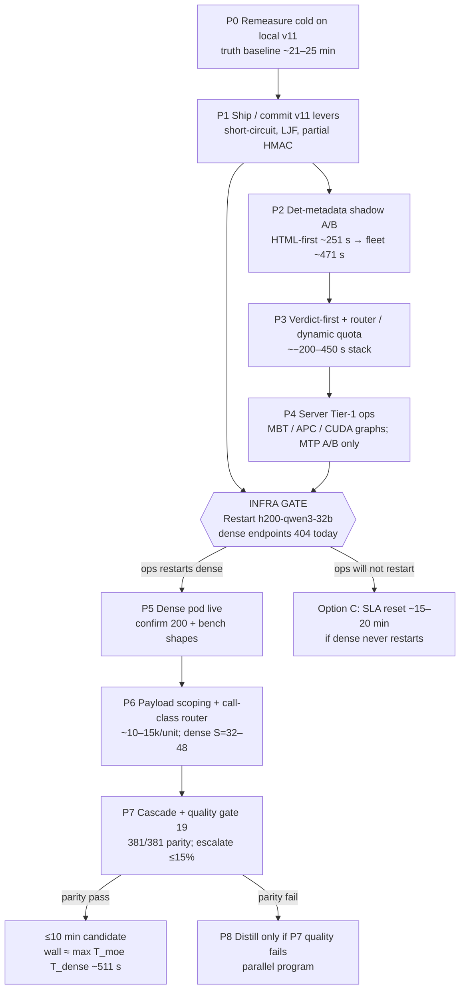

# Dependency graph — P0→P8 + infra gate

**Date:** 2026-07-24  
**Sources:** `PLANNING-HANDOFF.md` §6, `SYNTHESIS.md` execution order, reports `10`–`20`.

Phases are sequential where arrows show hard prerequisites. MoE software (P1–P4) can proceed while dense is down; ≤10 min remains blocked at the infra gate until P5.

## Phase unlocks

| Phase | Work | Unlocks |
|-------|------|---------|
| P0 | Remeasure cold on local v11 | Truth baseline (~21–25 min expected) |
| P1 | Commit/ship v11 levers already in tree | Stable short-circuit |
| P2 | Det-metadata shadow A/B (HTML-first → fleet) | −~251 then −~471 s |
| P3 | Verdict-first + router/quota | −~200–450 s stack |
| P4 | Server Tier-1 flags (ops) | L cut; not enough alone |
| **Gate** | Alliance restarts `h200-qwen3-32b` | Unblocks Option B |
| P5 | Dense live + recipe | Safe to route units |
| P6 | Payload scoping + call-class router | Dense S=32–48 (without scoping: negative EV) |
| P7 | Cascade + quality gate (`19`) | Ship Option B or fail closed |
| P8 | Distill | Only if P7 quality fails |

## Hard rules on the graph

1. **P6 before dense enable:** unscoped full-md dense → S≤16, L≈20 s, T_dense ≈ 2349 s (`12`, `23`).
2. **P7 before `_LANE_VERSION` bump** for default dense routing (`19`).
3. **P2–P4 do not unlock ≤10 min** without P5–P7 (`17`, `18`).
4. **Twin / S=32** are not nodes on this graph (forbidden).
