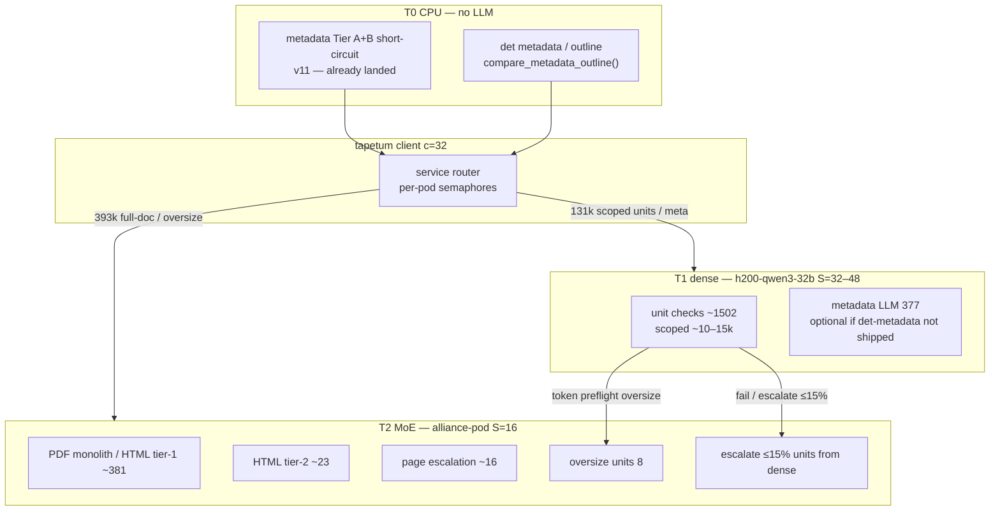
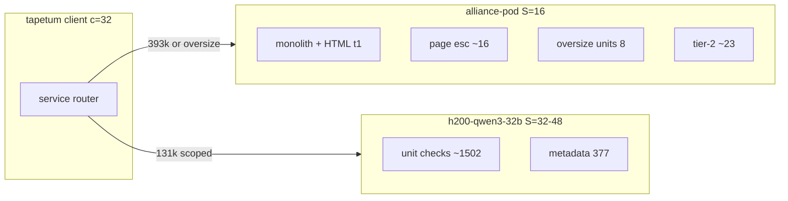
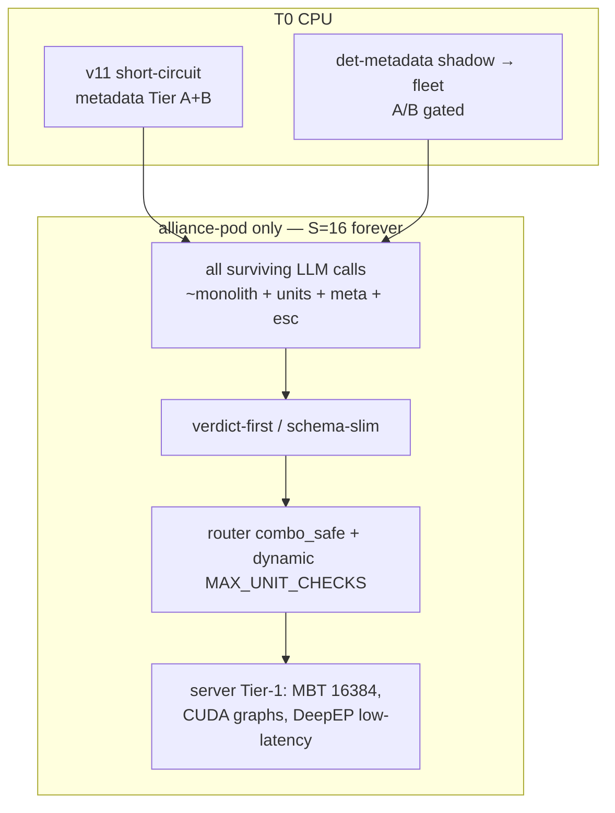
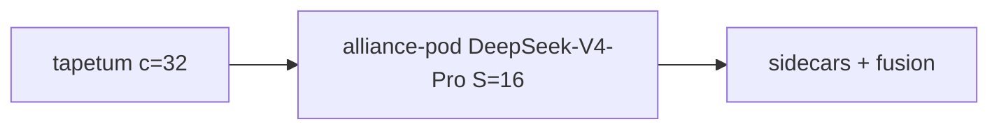

# STACK-DIAGRAM — Option B cascade + Option A MoE-only

**Sources:** `12-dense-offload-architecture.md`, `PLANNING-HANDOFF.md` §4, `SYNTHESIS.md`, `20-heterogeneous-wall.md`.

---

## Option B — Heterogeneous cascade (only ≤10 min design)

**Wall model:** `wall ≈ max(T_moe, T_dense) + T_client`  
**Central (scoped, 2× dense decode, parity):** MoE-bound ~**511 s** (planning band ~510–710 s).  
**Prereqs:** live `h200-qwen3-32b`, payload scoping, quality gate (`19`).

### Option B call split (report 12)

| Lane | Calls | Role |
|------|------:|------|
| MoE `alliance-pod` | ~428 | Monolith, HTML tier-1/2, page esc, oversize units, escalations |
| Dense `h200-qwen3-32b` | ~1879 | In-budget units + metadata (metadata drops if det-diff ships) |

**Scheduling:** `Semaphore(16)` on MoE, `Semaphore(32–48)` on dense. Fleet wall = **max**, not sum.

**Reserve (not primary):** `b300-qwen36-27b` after A/B. **Avoid primary:** `b200x2-gemma4`, `b200-r1`.

---

## Option A — MoE-only (shippable without dense infra)

**Wall model:** `wall ≈ (N_rem × L_eff) / 16 + T + C − L_abs`  
**Honest cold after full MoE package:** ~**12–23 min** (MODERATE ~23–25 min; AGGRESSIVE realistic without dense ~12–15 min).  
**Do not promise ≤10 min.**

---

## Option C — SLA reset (no diagram change)

If dense will not restart and twin stays forbidden: publish **~15–20 min** as the goal; stop the 10-min program. Stack remains Option A.

---

## Blockers on the diagram

| Node | Blocker |
|------|---------|
| Dense subgraph | All dense endpoints **404** today (`26`) — ask ops (`INFRA-ASK.md`) |
| Scoped unit edge | Payload scoping **not landed** — without it dense is negative EV |
| Ship edge | Quality gate ~0.8–1.2 h (`QUALITY-PROTOCOL.md`) |
