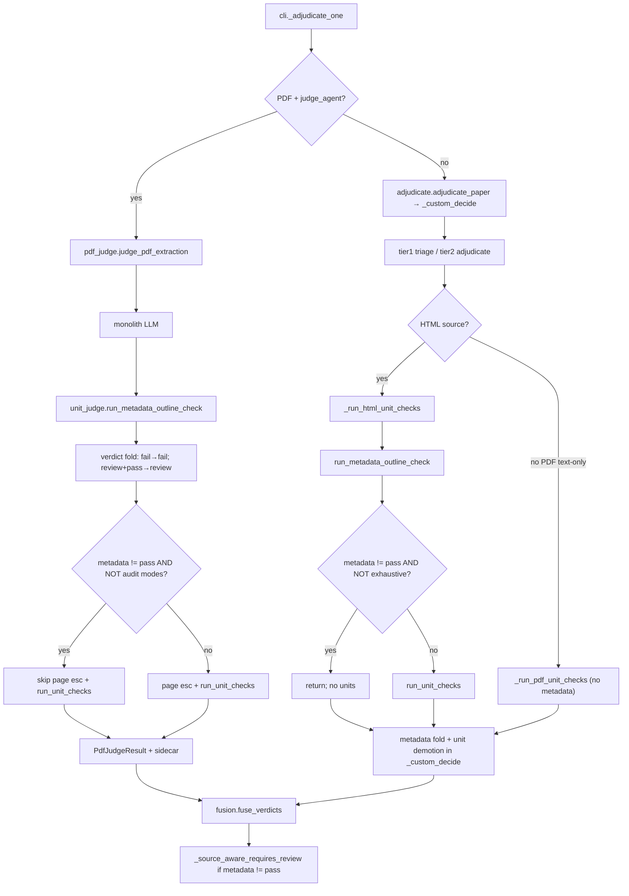

# 17 - Metadata-Short-Circuit Design

**Verdict:** usable-with-conditions — P145 is confirmed on verdict algebra; short-circuit is already wired at HEAD in the PDF primary path and HTML text path; default fleet saves up to **1047 unit + ~15 page-esc calls** (~1331 s upper bound) with **zero merged-verdict drift**, but **`--inspect` completeness requires the exhaustive bypass** already in CLI.
**Confidence:** high

## Executive answer

| Question | Answer |
|----------|--------|
| **Exact function to patch** | **`judge_pdf_extraction`** (`packages/whisker/src/whisker/tapetum_llm/pdf_judge.py:568`) — guard at **742–759**, skip body at **798**. Secondary: **`_run_html_unit_checks`** (`adjudicate.py:486`) — guard at **521–531**. |
| **Calls saved (v10 sidecar replay, P145)** | **1047** unit checks on 232 metadata-non-pass papers (**44.6%** of fleet LLM calls); plus **~15** page-escalation calls PDF-only. Rescaled to N=2284 wall model: **~1059–1331 s** @ 16 slots × 20 s/call. MODERATE Tier A+B (fail skip + review→1 unit): **847 calls / ~1059 s**. |
| **P145 claim confirmed?** | **Yes.** After metadata fold, unit checks cannot promote, cannot demote below the metadata cap, and fusion `source_aware_review_cap` fires before clear/rescue. Measured pre-ship: **0/32** metadata-fail papers would change `suggested_verdict` if units were stripped. |
| **Inspect quality caveat** | Default short-circuit drops `unit_checks`, `defect_groups`, and `page_escalations` on metadata-non-pass papers. **`--inspect` / `--exhaustive-units` / `--all-pages` bypass** the guard (`cli.py:1326–1328`). Sidecar `unit_coverage.mode = "metadata_short_circuit"` with `coverage_complete=True` is fusion-correct but **inspect_report** loses localized section/page quotes humans use to triage heading drift vs body omissions. |

---

## Call graph (metadata → cap → units)



---

## Branch points (exact locations)

### 1. `unit_judge.py` — metadata call (not a branch; always runs)

| Symbol | Lines | Role |
|--------|-------|------|
| `run_metadata_outline_check` | 231–273 | One LLM call per paper; returns `MetadataOutlineCheck` (`pass` / `review` / `fail`). |
| `run_unit_checks` | 317–528 | Unit loop; aggregate `verdict` is **`pass` or `review` only** (488–492). Never emits `fail`. |

Unit checks demote only via **`pass → review`** when defects, incomplete coverage, or uncertain evidence exist.

### 2. `pdf_judge.py` — primary fleet path (~184/381 papers)

| Step | Lines | Branch |
|------|-------|--------|
| Metadata call | 700–714 | Always after monolith; raises `PdfLaneError` on transport failure. |
| Verdict fold | 736–740 | `metadata fail → verdict fail`; `metadata review ∧ verdict pass → review`. |
| **Short-circuit guard** | **742–759** | `metadata_short_circuited = metadata != pass ∧ ¬all_pages ∧ ¬exhaustive_units`. |
| Page escalations | 798–898 | Entire block skipped when short-circuited. Escalations only demote `pass → review` (891–893). |
| Unit checks | 900–987 | `run_unit_checks` skipped when short-circuited. Demotion `pass → review` only (982–983). |
| Short-circuit sidecar | 1057–1066 | `unit_coverage.mode = "metadata_short_circuit"`, empty lists, `coverage_complete=True`. |

Audit bypass flags: `all_pages`, `exhaustive_units` (docstring 595–599).

### 3. `adjudicate.py` — HTML text lane (~197/381 papers)

| Symbol | Lines | Branch |
|--------|-------|--------|
| `_run_html_unit_checks` | 486–554 | Runs metadata **before** units. |
| Metadata call | 512–519 | Same `run_metadata_outline_check` as PDF. |
| **Short-circuit guard** | **521–531** | `metadata != pass ∧ ¬state.exhaustive → return` (skip units). |
| `_custom_decide` metadata fold | 382–389 | Applied **after** unit path returns; same algebra as PDF. |
| Unit demotion | 390–392 | `unit_result.verdict == review ∧ suggested pass → review`. |
| `_run_pdf_unit_checks` | 557–639 | **No metadata check.** Only reached for `--text-only` PDF (non-default). |

Order note: HTML folds metadata in `_custom_decide` after unit checks **would** run, but `_run_html_unit_checks` short-circuits before calling units, so the fold is the binding cap.

### 4. `cli.py` — routing and bypass

| Lines | Behavior |
|-------|----------|
| 1204–1205 | `use_pdf_judge = kind == "pdf" ∧ judge_agent` → fleet PDF never hits `_run_pdf_unit_checks`. |
| 1322–1329 | `exhaustive_units = args.exhaustive_units ∨ args.inspect` passed to `judge_pdf_extraction`. |
| 119–122 | `_LANE_VERSION = 11` bumps fingerprint when short-circuit ships. |
| 197–200 | `coverage_mode`: `inspect` → `"exhaustive"` (superset skip semantics). |

### 5. `fusion.py` — verdict cap (independent of whether units ran)

| Symbol | Lines | Rule |
|--------|-------|------|
| `_source_aware_requires_review` | 182–227 | **`metadata.verdict != pass → True`** (187–189). Also incomplete unit coverage, accepted high/critical defects. |
| `fuse_verdicts` | 410–423 | `det ∈ {pass, review} ∧ _source_aware_requires_review → combined review`, rule `source_aware_review_cap`. |

Fusion reads sidecar fields only; it never re-runs unit checks.

---

## P145 claim: can unit checks change verdict after metadata fail/review?

**Confirmed.** Verdict algebra is one-way and demotion-only after metadata fold.

### After `metadata.verdict == "fail"`

1. PDF: `verdict = "fail"` (737–738). HTML decide: `suggested_verdict = fail` (383–384).
2. `run_unit_checks` aggregate verdict ∈ `{pass, review}` — never `fail`.
3. Unit fold hooks only fire on `suggested_verdict == pass` (pdf_judge 982–983, adjudicate 390–392).
4. Fusion: metadata ≠ pass → `source_aware_review_cap` regardless of units.

Pre-ship sidecar replay (P145): **32/32** metadata-fail papers ended `suggested_verdict=fail`; **0** would change if units removed.

### After `metadata.verdict == "review"`

1. Fold caps `pass → review` (739–740, 386–389). Monolith/tier-2 may already be `review` or `fail`.
2. Units can only add another `pass → review` demotion — redundant when fold already applied.
3. Units **cannot** escalate `review → fail` (unit aggregate never returns `fail`).
4. Tier-2 axis `fail` on HTML (e.g. P3968R0) drives `suggested_verdict=fail` independently of units; skipping units does not soften that.

Pre-ship: **200 review** metadata papers ran **906** unit calls; **19** carried accepted high/critical unit defects, but merged verdict was already capped at `review` via metadata or axis fold.

### What units still buy on metadata-non-pass papers

Not merged verdict — **sidecar diagnostics**:

- Localized `candidate_not_found` quotes per page/section.
- `defect_groups` with mechanical count verification (e.g. keyword deltas).
- `inspect_report.py` sections for unit coverage, defect groups, page escalations (356–400, 419+).

**692/1047 (66%)** of those unit calls returned zero defects (P145) — pure latency with no finding.

---

## Implementation status at HEAD

Short-circuit is **already implemented** (v11):

- PDF: `judge_pdf_extraction` guard 742–759, skip 798–1055.
- HTML: `_run_html_unit_checks` guard 521–531.
- Tests: `test_pdf_judge.py::TestMetadataShortCircuit`, `test_source_aware_integration.py::test_html_metadata_short_circuit`.

This matches **Tier C** (full skip on fail **and** review) from tapetum-llm-speedup/17, not the MODERATE **Tier A+B** (review → 1 representative unit).

### Safest patch site (minimal A/B surface)

If re-implementing or tuning, the **lowest blast-radius** insertion point is unchanged:

```
pdf_judge.judge_pdf_extraction
  after run_metadata_outline_check + verdict fold (post-740)
  before page escalation loop (pre-798)
```

**Why here:**

- Single boolean gates **both** page escalations and units (serial chain after metadata).
- Monolith and metadata calls already ran — no change to first-pass recall.
- `all_pages` / `exhaustive_units` flags give a one-knob audit bypass (existing tests).
- No change to `unit_judge.run_unit_checks` signature or fusion matrix.
- HTML mirror stays a **5-line early return** in `_run_html_unit_checks` after metadata — same semantics, separate lane.

**Do not patch** `fusion.py` for speed (cap logic is correct) or `_custom_decide` alone (HTML needs pre-unit guard; PDF fleet never reaches `_run_pdf_unit_checks`).

**Gap (non-default):** `--text-only` PDF still runs `_run_pdf_unit_checks` without metadata. Not fleet-relevant; fix only if text-only PDF becomes supported.

---

## Calls saved estimate

Source: tapetum-llm-speedup/17-metadata-short-circuit.md (v10 sidecar replay, 378 ok / 381 total).

| Tier | Policy | Unit calls removed | Est. wall @ S=16, L=20 s |
|------|--------|-------------------:|-------------------------:|
| **A** | Skip units on `metadata fail` only | 141 | ~179 s |
| **B** | A + on `review`, run 1 unit (not 5) | 847 (A+B combined) | ~1059 s (N=2284 model) |
| **C (HEAD default)** | Skip all units + page esc on fail **and** review | 1047 (+ ~15 page esc) | ~1331 s (sidecar N=2362 model) |

Percentage anchors:

- **44.6%** of fleet LLM calls (P145 / 00-baseline) are fusion-dead unit work after metadata non-pass.
- **66.7%** of unit calls (1047/1570 sidecar count) on those papers.
- Rescaled MODERATE planning number: **847 calls**, not 1047 (`148-verifier-stacking-arithmetic.md`).

Page escalations (PDF-only, 15/18 calls on metadata-non-pass) are **included** in HEAD short-circuit but **excluded** from the 1047 unit-only figure.

---

## Quality caveats for inspect reports

### Merged verdict / fusion — LOW risk

Metadata cap and unit demotion algebra guarantee no silent pass on metadata-non-pass when fold + fusion run. Dev-replay gate: **0** papers where stripping units would flip `suggested_verdict` to a better tier on metadata-fail.

### Human inspect completeness — MEDIUM risk (default fleet)

When short-circuit fires (no `--inspect`):

1. **`unit_checks` / `defect_groups` empty** — inspect_report loses per-section/page grounded quotes even when metadata only summarized heading drift.
2. **`page_escalations` empty** on PDF — no page-attributed missing-content quotes from escalation path.
3. **`unit_coverage`** shows `coverage_complete=True`, `checked=0`, `mode=metadata_short_circuit` — correct for fusion (avoids double-cap on incomplete coverage) but **misleading to a human** skimming "complete=true" without reading `mode`.
4. **19 papers** (P145) had accepted high/critical unit defects under metadata `review`; merged verdict unchanged, but **inspect triage depth** regresses on cold fleet runs.

Mitigations already shipped:

- **`--inspect` sets `exhaustive_units=True`** → full unit path for golden-PR review (`cli.py:1326–1328`).
- **`--exhaustive-units` / `--all-pages`** same bypass.

Recommendation for operators: treat default fleet sidecars as **verdict-triage**; run `--inspect` (or `--exhaustive-units`) when metadata is non-pass and localized evidence is needed.

### False-pass / false-fail (from P145)

- **False-pass:** P4231R0 — metadata fail locks fail; skipping units loses quotes, not merged verdict.
- **False-fail:** P3968R0 — tier-2 axis fail drives outcome; unit skip removes corroboration only.

---

## A/B validation checklist

Minimal acceptance surface (from existing tests + P145 replay criteria):

1. **Verdict histogram** — cold fleet before/after: expect identical `suggested_verdict` / fusion `combined_verdict` distribution.
2. **Zero flip replay** — all sidecars where `metadata_outline_check.verdict in {fail, review}`: recomputing verdict without unit/page-esc artifacts must match stored verdict.
3. **Inspect bypass** — `--inspect` on metadata-fail fixture still invokes `run_unit_checks` (`test_exhaustive_bypasses_short_circuit`).
4. **Fusion cap** — metadata-fail sidecar with empty units still yields `source_aware_review_cap` when det=pass.
5. **Dev-replay recall** — defect_groups recall on 9 golden PRs must not drop (MODERATE Tier B); Tier C trades inspect depth, not dev-replay pass/fail labels.

---

## References

- P145 / fusion-dead unit calls: `research/cold-run-10min/00-baseline.md:25`
- Sidecar replay and tier math: `research/tapetum-llm-speedup/17-metadata-short-circuit.md`
- N=2284 rescale: `research/tapetum-llm-speedup/148-verifier-stacking-arithmetic.md:10,22`
- HTML lane mirror: `research/tapetum-llm-speedup/42-text-lane-accountant.md:16`
- Implementation: `_LANE_VERSION = 11`, `cli.py:119–122`
