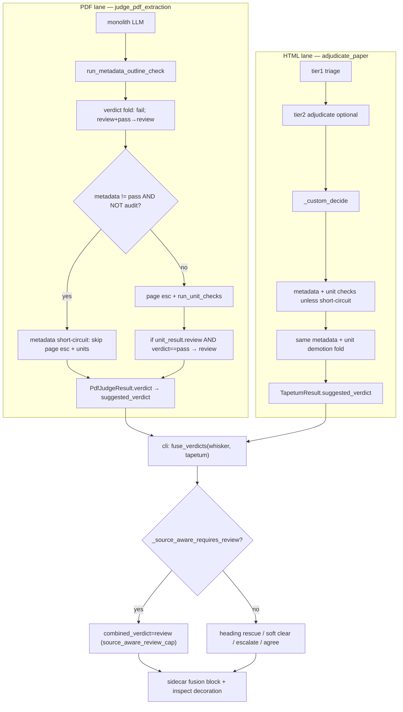

# 70 - Fusion / Adjudicate: When Unit Checks Change Verdict vs Inspect-Only

**Verdict:** usable-with-conditions — the prior **16/381 (~4.2%)** merged-verdict stat still matches HEAD fusion algebra, but it counts **all LLM findings** (heading rescue + soft clear), not unit checks alone; **~84% of papers** are fusion-capped before unit outcomes can move `combined_verdict`.
**Confidence:** high

## Executive answer

| Layer | What changes | Unit-check role |
|-------|----------------|-----------------|
| **whisker `verdict`** | Never | Units never touch deterministic gate |
| **`suggested_verdict`** (tapetum sidecar) | LLM lane advisory | Demotes `pass→review` when `unit_result.verdict=="review"` after monolith/metadata fold |
| **`fusion.combined_verdict`** | Merged advisory | Units move merged verdict only via `_source_aware_requires_review` (accepted high/critical defect groups, incomplete coverage); cap runs **before** clear/rescue |
| **`--inspect` report** | Human decoration | Always renders `unit_checks`, `defect_groups`, `unit_coverage`, page table when sidecar fields exist |

**Prior 16/381:** measured 2026-07-23 fleet (`research/tapetum-llm-speedup/00-baseline.md:29-30`, replayed in `research/tapetum-llm-throughput/12-false-economy-hunter.md:10`). **Still valid at HEAD** — same `fuse_verdicts` ordering and unit demotion hooks; metadata short-circuit (wired `pdf_judge.py:742-759`, `adjudicate.py:521-531`) removes calls on metadata-non-pass papers but **0/32** `suggested_verdict` drift when units stripped (`research/cold-run-10min/17-metadata-shortcircuit-design.md:12`).

**Unit-only merged flip:** sidecar replay found **3/381** papers where accepted high/critical `defect_groups` drove `source_aware_review_cap` (`12-false-economy-hunter.md:10`). The **16/381** headline is **not** a unit-only count.

---

## Call graph (adjudicate → decide → fuse)



File anchors:

- Decide + unit demotion (HTML): `packages/whisker/src/whisker/tapetum_llm/adjudicate.py:314-392`
- Decide + unit demotion (PDF): `packages/whisker/src/whisker/tapetum_llm/pdf_judge.py:736-740`, `982-987`
- Unit verdict algebra: `packages/whisker/src/whisker/tapetum_llm/unit_judge.py:439-492`
- Fusion cap (before clear/rescue): `packages/whisker/src/whisker/tapetum_llm/fusion.py:410-423`
- Inspect rendering (no verdict logic): `packages/whisker/src/whisker/tapetum_llm/inspect_report.py:371-493`
- Sidecar persist + fusion attach: `packages/whisker/src/whisker/tapetum_llm/cli.py:736-765`

---

## When unit findings **change** verdict

### 1. `suggested_verdict` (tapetum sidecar)

After monolith/triage + metadata fold, unit checks run (unless metadata short-circuit or no risk signals):

```382:392:packages/whisker/src/whisker/tapetum_llm/adjudicate.py
    if state.metadata_outline_check is not None:
        if state.metadata_outline_check.verdict == VERDICT_FAIL:
            suggested_verdict = VERDICT_FAIL
        elif (
            state.metadata_outline_check.verdict == VERDICT_REVIEW
            and suggested_verdict == VERDICT_PASS
        ):
            suggested_verdict = VERDICT_REVIEW
    if state.unit_result is not None and state.unit_result.verdict == "review":
        if suggested_verdict == VERDICT_PASS:
            suggested_verdict = VERDICT_REVIEW
```

PDF lane mirrors this at `pdf_judge.py:982-987`.

`UnitJudgeResult.verdict` becomes `"review"` when any of (`unit_judge.py:488-492`):

- Non-empty **`defect_groups`** after evidence verification (only `candidate_not_found` + `GROUND_EXACT` defects survive aggregation)
- **`coverage_complete`** false (unchecked/failed units, quota overflow, empty source packets)
- **`evidence_uncertain`** (ambiguous or source-ungrounded dispositions)

Metadata fail/review can demote **before** units; units cannot promote above metadata fail.

### 2. `fusion.combined_verdict` (merged advisory)

Units influence fusion only through `_source_aware_requires_review` (`fusion.py:182-227`):

| Trigger | Unit-related? | Baseline papers (replay) |
|---------|---------------|--------------------------|
| `metadata_outline_check.verdict != pass` | No (metadata call) | 240 |
| `unit_coverage.coverage_complete != true` or failed/unchecked IDs | Yes (routing/cap) | 101 |
| Accepted high/critical `defect_groups` with verified counts or exact `candidate_not_found` disposition | Yes (unit evidence) | **3** |
| `all_pages_requested` with gaps | Yes (coverage mode) | subset of 101 |

Critical ordering — cap **blocks** downstream promotion:

```410:423:packages/whisker/src/whisker/tapetum_llm/fusion.py
    if det in (VERDICT_PASS, VERDICT_REVIEW) and _source_aware_requires_review(
        tapetum
    ):
        return FusionResult(
            combined_verdict=VERDICT_REVIEW,
            combined_rule=FUSION_RULE_SOURCE_AWARE_REVIEW_CAP,
            ...
        )
```

Clear/rescue rules (`llm_clear_soft_review`, `llm_rescue_heading`) sit **after** this branch (`fusion.py:438-519`). On **321/381** cap papers, unit LLM calls cannot change `combined_verdict` regardless of findings (`12-false-economy-hunter.md:10`).

The measured **16 merged flips** use different rules entirely:

| `combined_rule` | Count | Driven by unit checks? |
|-----------------|------:|------------------------|
| `source_aware_review_cap` | 321 | Cap only; units rarely the *decisive* delta |
| `llm_rescue_heading` | 9 | Monolith/axis — heading-monotone whisker fail |
| `llm_clear_soft_review` | 7 | Monolith/axis — soft-flag whisker review |
| `llm_escalate_major` | 0 | Monolith major axis fail |
| `agree` / `whisker_only` / `whisker_fail_locked` | 27 | No LLM promotion path |

**16 = 9 + 7** papers where LLM changed merged vs whisker-only; **not** attributable primarily to unit checks.

---

## When unit findings **only decorate inspect**

Inspect is a pure renderer: it lists sidecar fields (`defect_groups`, `risk_signals`, `evidence_dispositions`, page coverage table) without recomputing verdicts (`inspect_report.py:272-493`).

Unit work is inspect-only (no merged movement) when:

1. **Zero-defect unit check** — 70% of calls (1057/1510); `unit_result.verdict=="pass"`, empty `defect_groups` (`00-baseline.md:26-29`).
2. **Refuted claims** — defects with `present_in_candidate` never enter `defect_groups` (`unit_judge.py:452-456`); may still appear in `evidence_dispositions` table in inspect.
3. **Fusion already capped** — metadata-non-pass (244 papers, 1043 fusion-dead unit calls) or incomplete coverage; findings add quotes but `combined_verdict` unchanged (`12-false-economy-hunter.md:14`).
4. **Metadata short-circuit (default fleet)** — units never run; sidecar gets `unit_coverage.mode=metadata_short_circuit`, inspect loses unit detail unless `--inspect` / `--exhaustive-units` / `--all-pages` bypass (`17-metadata-shortcircuit-design.md:13`).
5. **whisker `det=fail`** — fusion locked (`whisker_fail_locked`) except heading-monotone rescue; unit defects do not merge to pass.
6. **Low severity / unverified groups** — fusion cap requires high/critical + accepted disposition or verified count (`fusion.py:209-225`); minor defects may show in inspect only.

---

## Prior 16/381 — still valid in code?

| Claim | Status at HEAD |
|-------|----------------|
| 16/381 papers had **merged** verdict changed by LLM | **Valid baseline measurement** (2026-07-23 sidecars); not re-run in this pass |
| Breakdown 9 rescue + 7 clear | **Valid** — rules unchanged in `fusion.py` |
| ~143 LLM calls per changed merged verdict (2284/16) | **Valid arithmetic** on v10 call census |
| 70% zero-defect unit checks | **Valid** — same `run_unit_checks` aggregation |
| Metadata short-circuit zero verdict drift | **Valid** — guard + fold algebra unchanged; P145 0/32 |
| 3 papers: unit defect_groups as cap driver | **Valid** — `_accepted_unit_defects` / `_group_matches_accepted_defect` unchanged |

**Caveat:** HEAD adds metadata short-circuit (fewer unit sidecars on metadata-fail papers). That **reduces inspect decoration** and call volume; it does **not** change the 16 merged-flip count because fusion cap already fired on metadata before units ran.

**Not valid to read 16/381 as "units change verdict on 4.2% of papers."** Correct reading: **4.2% of papers** had any LLM-driven merged delta; **~0.8% (3/381)** had unit-sourced accepted defect groups as a fusion cap input; **~84% (321/381)** were capped such that unit outcomes could not move merged verdict.

---

## Findings

- [CRITICAL] **Three verdict layers; units touch the top two only.** Evidence: whisker never reads tapetum (`fusion.py:12-13`, `CLAUDE.md` advisory section); `suggested_verdict` demotion at `adjudicate.py:390-392` / `pdf_judge.py:982-987`; fusion pure function `fusion.py:348-549`. Impact: "final verdict" for operators is usually `fusion.combined_verdict` in `report-merged.md`, not inspect tables.

- [CRITICAL] **16/381 is merged-verdict delta, not unit delta.** Evidence: `tapetum-llm-speedup/00-baseline.md:29-30`; rule histogram `12-false-economy-hunter.md:10` (321 cap + 9 rescue + 7 clear). Impact: speed levers that strip unit calls must track **defect-group recall on the 3 cap-driver papers** and **suggested_verdict demotion cases**, not the 16-paper merged set alone.

- [HIGH] **321/381 fusion caps precede clear/rescue — most unit spend is fusion-dead.** Evidence: `fusion.py:410-423` before `477-519`; 1321 unit calls on cap papers (`12-false-economy-hunter.md:10`). Impact: metadata short-circuit (~1047 calls) is fusion-safe for merged verdict; inspect loses localized quotes on skipped papers.

- [HIGH] **Unit verdict change requires verified absence, not LLM fail alone.** Evidence: `verify_unit_evidence` → only `CANDIDATE_NOT_FOUND` + `GROUND_EXACT` enter `defect_groups` (`unit_judge.py:439-467`); refuted defects decorate inspect via dispositions only. Impact: table-cell swaps that survive as `present_in_candidate` do not demote via defect_groups (test: `test_source_aware_integration.py:741-785` for positive demotion case).

- [MED] **Inspect always shows unit artifacts when present; `--inspect` bypasses short-circuit.** Evidence: `inspect_report.py:419-493`; CLI bypass `17-metadata-shortcircuit-design.md:13`. Impact: inspect completeness ≠ verdict influence.

- [MED] **Coverage incomplete from routing gaps caps fusion without LLM call.** Evidence: empty `unit_text_map` skip `unit_judge.py:381-385`; 111 no-packet warnings → `coverage_complete=false` (`12-false-economy-hunter.md:8`). Impact: zero-token "false economy" still forces review cap via fusion, not via unit findings.

---

## False-pass hypothesis

Strip unit checks on metadata-pass / whisker-pass papers with five zero-defect historical unit runs: a table-boundary defect the monolith missed would still show whisker `pass` and fusion `pass` (no cap trigger), while inspect would lack the unit quote trail — same selection-gap class the 16/381 stat was meant to guard (`00-baseline.md:29-30`).

## False-fail hypothesis

Treat all 321 `source_aware_review_cap` papers as "units failed": most cap drivers are metadata-not-pass (240) or routing incomplete coverage (101), not verified unit defects — inspect may show clean unit tables while merged stays review.

## What would change my mind

A fresh 381-paper sidecar replay at HEAD reporting (a) merged-rule histogram differing from 9+7+321 split, or (b) **>16** papers where stripping `defect_groups` + `unit_coverage` alone (metadata pass, coverage complete) changes `combined_verdict`.

---

## Percent summary (381-paper v10 fleet)

| Metric | Value | Notes |
|--------|------:|-------|
| Merged verdict changed by **any** LLM finding | **16/381 (4.2%)** | Prior corpus; code algebra unchanged |
| Fusion `source_aware_review_cap` (units often irrelevant) | **321/381 (84.3%)** | Cap before clear/rescue |
| Accepted unit defect_groups as cap driver | **3/381 (0.8%)** | Sidecar replay |
| Unit checks returning zero defect groups | **1057/1510 (70%)** | Inspect-only on cap papers |
| Unit calls fusion-dead after metadata non-pass | **1043 calls (~45% fleet)** | Short-circuit target |

**Answer for parent agent:** **16/381 (~4.2%)** for merged LLM verdict change — **still valid in code**, but **unit checks alone** move merged verdict on **~3/381** via defect groups; on **~321/381** unit findings at most **decorate inspect** (and may shift `suggested_verdict`) without changing `combined_verdict`.
