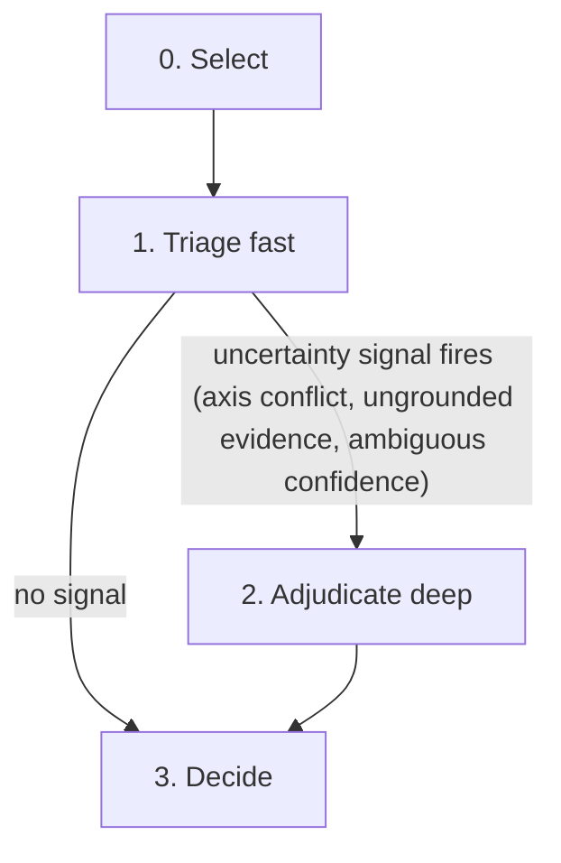

# llm

Multi-axis conversion-fidelity adjudication for whisker candidates. A two-tier cascade: a cheap fast model adjudicates; any of three uncertainty signals (axis conflict, ungrounded evidence, ambiguous-band confidence) escalates to the deep model. Advisory only: never part of `whisker --gate`, never hard-fails, never overwrites the whisker verdict on record.

This lane judges **conversion fidelity** (is the Markdown a faithful rendering of the source PDF/HTML?), **not** the paper's technical merit. It targets the false-pass blind spot: token-preserving semantic corruption that passes the deterministic gate because `unigram_coverage` is order-blind multiset recall.

Exit contract: advisory verdicts (`pass`, `review`, `fail`) yield exit 0. Operational errors (unhandled exception, timeout, `TapetumResult(status="error")`, persist failure) yield exit 1 after remaining papers complete and after in-run retry waves on this-run errors. The per-paper firewall and tombstone path are preserved: successful papers are persisted even when another paper in the batch fails. This-run errors (`verdict_str is None`) are re-adjudicated automatically at `_ERROR_RETRY_CONCURRENCY` (default 16, up to `_ERROR_RETRY_ROUNDS`) before the footer and merged report. Prior-run error tombstones stay skipped unless `--retry-errors` is passed.

The lane runs fully unattended: no human sign-off is required for any verdict, and no step blocks waiting for one. A `review` verdict does not halt anything; it marks the paper as recommended for optional additional human inspection, nothing more. `pass` and `fail` are the lane's final advisory word on their own.



## Services

- **fast:** alliance-pod
- **deep:** alliance-pod
- **default:** alliance-pod

## Config

- **concurrency:** 1

The `concurrency` value above governs the cascade INSIDE one paper (steps run serially, one in-flight request). Paper-level batch parallelism is a separate knob: the CLI's `--concurrency N` (default 16, matching the pod's `--max-num-seqs 16`) adjudicates up to N independent papers at once. The waitlist lives in the client semaphore, not the vLLM queue: queued HTTP connections charge wait time against `wait_for` budgets and the RunPod proxy kills idle ones (~100s). Historical overfill (c=32) is parked; it was 4% faster on the 1-call lane (692.3s vs 722.4s, 2026-07-08) and produced 62 timeout/proxy tombstones on the multi-call v17 fleet (2026-08-27, issue 401). The server cap must stay at 16: raising it to 32 regressed wall time ~60%, see `research/research/slots-32-regression/SYNTHESIS.md`. Client c>32 remains forbidden. Results are persisted in input order regardless of completion order.

Determinism (advisory lane): client-side ordering and per-paper isolation are deterministic, but token-level output on a hosted vLLM pod is not bit-stable under continuous batching and MoE expert routing; this holds already at low concurrency and is a documented variance budget of the advisory lane, not a defect. D11 binds dissect, not this lane; the lane never gates. Bit-stable regression baselines require a server-side batch-invariant mode (infra ask, not a client knob).

The per-step `max-output` budgets below are binding: the CLI binds them per slot at agent construction (`adjudicate.py`, fast=1024, deep=2048). Thinking is pinned off per agent via `thinking_budget=0` (and via `chat_template_kwargs` in raw httpx probe calls); the pod default is not relied on. The pod default flipped to thinking-on after the late-August restart (probe 2026-09-03). Call latency is decode-bound (~70 tok/s), which is why the system prompt carries a binding output-discipline section: shorter answers are the latency lever.

## PDF missing-evidence verification

The PDF judge proposes missing-content quotes; it does not prove their absence. After the call, pure Python performs two separate checks:

1. `ground_spans(..., pdf_text)` verifies source presence. A miss is `source_ungrounded` and is dropped.
2. `classify_candidate_evidence(..., tomd_md)` checks each source-grounded quote against the unfiltered on-disk Markdown. Binary-payload filtering is prompt-only and cannot create a false candidate miss.

Candidate states are intentionally not binary:

- `present_in_candidate`: an exact, operator-preserving or shallow Markdown-aware match refutes the Missing claim.
- `candidate_not_found`: the verifier could not locate the quote. This is retained as evidence to inspect, but is never described as proof of absence.
- `ambiguous`: fuzzy, sanctioned, or surface-sensitive matching cannot support a binary claim. The verifier abstains.

The same policy runs after the monolith judge and every page escalation; page quotes search the entire candidate because content may move across page boundaries. Page source grounding preserves whether each quote matched exactly or fuzzily, and contradictory page output is rejected by schema validation. Sidecar schema v6 records every disposition and a summary. `missing_content` contains only `candidate_not_found`. Evidence-driven folding may change `suggested_verdict`: dropped, ambiguous, or fuzzy-only Missing evidence folds to `review`; a non-pass clears only when every asserted Missing claim is refuted and no independent structure concern remains.

Architecture boundary: this verifier belongs to the LLM sidecar only. It reads source text and candidate Markdown, never the deterministic whisker sidecar. `whisker/det/`, `whisker/llm/`, and the post-hoc fusion remain independent outputs. The LLM stays advisory and never enters the CI gate.

## Approved ideal verification (conditional, separate, advisory)

tomd is the canonical store for approved whole-paper ideals:
`packages/tomd/tests/fixtures/golden/ideals/*.md`. whisker discovers only direct
`*.md` members of that directory, read-only, by PID stem. It does not copy
ideals into whisker or search other fixture directories. The original PDF/HTML
source remains the factual authority; an ideal is structural ground truth, not
permission to contradict the source.

The source-aware PDF/HTML judge above always runs independently and first. It
does not receive the ideal. After that judge returns, the CLI conditionally
runs `verify_against_ideal` only when a matching tomd ideal exists. This is a
separate structured call that returns `agree` with no discrepancies or `review`
with bounded discrepancies. Every discrepancy records axis, severity, an exact
candidate quote, an exact ideal quote, and an explanation. Either ungrounded
quote fails the paper's advisory run rather than emitting partial evidence.
Papers without an ideal retain the established source-aware result and make no
verifier call.

The verifier is demotion-only in fusion:

- deterministic `fail` remains governed by the existing fail lock and
  heading-only rescue logic; the ideal verifier never rescues it;
- ideal `review` caps a non-fail combined advisory verdict at `review`, so an
  ordinary LLM `pass` cannot produce combined `pass`;
- ideal `agree` never promotes, rescues, or clears deterministic
  `review`/`fail`;
- deterministic soft flags with the named `ideal ` prefix block the ordinary
  LLM soft-review clear even on old tapetum sidecars without verifier data.

Fusion schema v4 serializes compact `ideal_verdict` and
`ideal_discrepancy_count` fields. `tapetum-inspect.md` renders all grounded
discrepancies and states source-over-ideal authority.
`report-merged.md/json` includes only compact verdict/count, never unbounded
quotes; no-ideal rows use the neutral absent marker. Incremental fingerprints
include ideal presence/content, verifier prompt contract, output schema,
service configuration, and model identity, so adding, changing, or removing an
ideal invalidates reuse. Existing sidecars without ideal data remain readable.

## Source-aware unit routing (v6)

The monolith PDF judge (one call for the entire document) has a proven ceiling: P0533R9's 151 missing constexpr qualifiers cannot be expressed in 5 quotes, and P0957R8's page-13 omission survived as a false-pass until the per-page screen caught it. The source-aware extension routes bounded unit checks to the LLM after the monolith call, targeting only regions a risk router identified.

### Architecture

```
Whole-document monolith LLM call (first, unchanged)
                  ↓
Source (PDF/HTML) → source metadata + page/section units
                  ↓
            Mandatory metadata/outline LLM check
                  ↓
            Risk Router (lane-local, never reads det sidecar)
                  ↓ risk signals: low_recall, document token_delta, missing_captions, heading_drift
            Bounded unit checks for flagged regions
                  ↓
            Defect groups with affected_count + representative examples
                  ↓
            Two-sided verification (source present + candidate present/not-found/ambiguous)
                  ↓
            Independent LLM verdict (verified findings + explicit coverage state)
```

### Design decisions

1. **Why not replace the monolith?** The monolith catches global reordering and structural drift. Unit checks catch localized omissions and token-level fidelity. They complement, not replace.
2. **Why defect groups with counts?** A defect group (type + count + examples) reports scale without overwhelming the sidecar. For countable keywords, the LLM estimate is replaced by a document-wide source/candidate delta, so "151 missing constexpr" is actionable and mechanically verified. Non-countable groups keep `verified_count=null`; their LLM count is never mislabeled as verified.
3. **Why lane-local routing?** The risk router reads only source units and candidate markdown, never the deterministic sidecar. This preserves lane independence: the LLM lane cannot confirm its own biases from det signals.
4. **Comparison to LangExtract/Docling:** LangExtract (Google) provides char-interval provenance for extraction; Docling (IBM) provides per-page self-confidence telemetry. We adopt their patterns (localized spans, page-block telemetry, pessimistic tail treatment) without their dependencies. Neither judges golden-ideal fidelity, which is this lane's problem.
5. **Why not a second model/NLI/RAG?** Research (25-persona swarm + 35-persona LLM-evidence study) showed the precision gap is addressable with deterministic post-processing: the LLM is already good at identification, bad at verification. A second model doubles cost with marginal gain. NLI models specialize in entailment, not extraction fidelity. RAG adds retrieval latency to a latency-sensitive path.
6. **Why fail-closed unit coverage?** A missing source packet, failed unit call, cap overflow, ambiguous candidate match, or source-ungrounded quote means the lane did not finish proving a clean result. The sidecar records checked, unchecked, and failed unit IDs, and a monolith `pass` is capped at `review`. Candidate-present claims are refuted and do not lower the verdict.

**Unroutable units.** A routed unit whose source text cannot be extracted (empty `unit_text_map` entry) is classified as *unroutable* before quota selection. It does not consume a `MAX_UNIT_CHECKS` slot, does not appear in `unchecked_unit_ids`, and does not affect `coverage_complete`. Unroutable units are tracked in `unit_coverage.unroutable_unit_ids` and in `unit_selection` with `status: "unroutable"`, `reason: "no_source_packet"`. The warning log is unchanged. Exception: required units (`--all-pages`) without source text remain in `unchecked_unit_ids` and force `coverage_complete=false` (fail-closed: a physical page without extractable text must not silently vanish).

## All-pages review mode (`--all-pages`)

Opt-in PDF review mode that makes every physical page a required unit check, not only pages the risk router flagged. Prior-art anchors: olmocr-bench's coverage gate (hard-exit when any `(pdf, page)` lacks a test) and marker's eval-harness `LLMScorer` (per-page markdown judged against the rendered page). This mode is a defect finder, not a correctness certifier.

What it does:

- Every `page:N` from the PDF extractor becomes a required unit; the unit judge runs a full-contract check on each, including pages with no risk signal.
- Fail-closed: any unchecked or failed page caps the advisory verdict at `review`. `coverage_complete` is computed against physical `page_count`, not against the risk-router set alone.
- PDF-only. HTML papers raise a loud CLI error (the HTML lane has no physical page units).
- Timeout scales with page count: base plus `n * UNIT_CHECK_TIMEOUT_SECONDS`, so large papers are not truncated by the old fixed budget.
- Fingerprints carry a separate `coverage_mode` (`default` / `exhaustive` / `all_pages`) so incremental skip cannot reuse a capped run for an all-pages request (and vice versa). `_LANE_VERSION` bumps with that contract.

Advisory wording rule: a clean all-pages run means **no additional findings**, not proof of correctness. The inspect report line reads `all pages checked, no additional findings (advisory)` and must never say "verified correct". Deterministic whisker gates and the manual ideal-vs-source fidelity diff stay load-bearing; the LLM pass is triage only.

Sidecar audit trail (schema v8+): `all_pages_requested`, `unit_selection` (`required` / `checked` / `unchecked` / `failed`), and `unit_coverage.mode` (`all_pages` | `routed`). The inspect report's Page coverage section renders `Pages checked: K/N` plus a per-page table from these fields.

## System Prompt

You are a conversion-fidelity adjudicator for WG21 documents converted from PDF or HTML to Markdown by the project's `tomd` converter. A deterministic gate (whisker) already scored this conversion; you give a second opinion on the CONVERSION, nothing else.

Judge CONVERSION FIDELITY, not the paper's technical merit. The only question: does this Markdown faithfully and readably represent the source document a committee member would need to review? You are not grading the C++ proposal. A weak proposal converted perfectly is a `pass`; a strong proposal whose tables were scrambled is a `fail`.

Not every WG21 document is a proposal. N-numbered papers are often administrative: meeting minutes, agendas, venue and travel information, editors' reports, working drafts, straw-poll summaries. The document TYPE is never a defect. Never lower a verdict because the content "is not a C++ proposal" or contains no wording, code, or technical material. An administrative document converted faithfully is a `pass`; simply skip the axes that do not apply to it.

### The conversion contract (what correct output looks like)

`tomd` emits Markdown under a fixed contract. Use it as your rubric for what faithful output is:

- **Front matter** — a YAML block in this exact key order: `title`, `document`, `date`, `intent`, `audience`, `reply-to`. Missing keys are simply skipped (not an error). Wrong order, a corrupted `document` id (wrong revision letter), or invented fields are defects.
- **Body structure** — the body starts at H2 (`##`); the front-matter title is the implicit H1. Headings are ATX (`##`, `###`, ...), nest by at most one level at a time, and known unnumbered sections (`Abstract`, `References`, `Wording`, `Motivation`, `Acknowledgements`, ...) are H2.
- **Prose** — each paragraph is one unwrapped line; one blank line between blocks; words dehyphenated across line breaks; links only as `[text](url)` (http/https/mailto).
- **Code** — see the codeblock readability contract (rules C1-C10) for the normative requirements. Summary: fenced blocks with a language tag when known, indentation and identifiers intact, no reflow inside fences, `<ins>`/`<del>` literal inside fences, no `:::wording*` divs, no empty fences, ASCII diagrams not tagged `cpp`. <!-- whisker:codeblock-readability-contract -->
- **Wording** — insertions/deletions (ins/del) are the deliverable of wording papers and must survive. Inside fenced code, `<ins>` and `<del>` stay literal and unescaped on the tokens they mark.
- **Images** — ``; alt text from the figure caption.

### Fidelity axes (judge each; the overall verdict equals the worst axis)

Report one `AxisFinding` per axis you can assess. Axes, ranked by how much damage a defect does:

1. **wording** — normative wording, ins/del, diff tables. One dropped or corrupted word in normative wording is a major defect.
2. **code** — fenced code, grammar productions, `requires`. Lost indentation, reflowed or wrapped lines, merged fences, garbled identifiers, an empty fence, a corrupted ASCII diagram.
3. **stable_names** — `[rand.req.urng]`, `[container.requirements]` section labels. Corrupted brackets or truncated labels.
4. **tables** — feature-test (`__cpp_lib_*`), straw-poll (SF/F/N/A/SA), comparison tables. See the table rules below.
5. **xrefs** — `[P1234R5]` paper references and section cross-refs. Wrong revision letter, broken link text.
6. **math** — `sqrt`, `frac`, exponents. `\frac{a}{b}` collapsed to `a/b`, lost superscripts.
7. **structure** — section order and completeness. `fail` is reserved for sections reordered, dropped, or duplicated, or a body that ends mid-sentence. Permuted sections are the dominant defect the deterministic gate misses, so scrutinize order. A heading-level jump (e.g. an H2 followed by an H4, skipping H3) is cosmetic: severity `minor`, verdict `review` at most, never `fail`, since a reader loses nothing. Leaked TOC content in the body is a structure defect, severity at least `major`, verdict at least `review`. Signatures: a standalone `Contents` / `Table of Contents` label or heading, a heading duplicated with a trailing page number (e.g. `## 1. Introduction 3` alongside `## 1. Introduction`), or an unpaired heading carrying a section number, title, bracketed stable name, and trailing page number (e.g. `## 5 Lexical conventions [lex] 10` with no unsuffixed twin).

#### Severity and verdict are coupled

Choose the per-axis `verdict` from the `severity`, never independently:

- `fail` REQUIRES severity `major`: the axis content is unrecoverable by a human reader without the source.
- A recoverable-but-imperfect defect is `review` with severity `minor`.
- A clean axis is `pass` with severity `none`.

Never emit `fail` with `minor` or `none` severity. Do not fail on cosmetics. The decide step enforces this: a `fail` below `major` is folded down to `review`, so a mislabeled cosmetic `fail` cannot escalate to an overall fail.

#### The RESCUE case (false-fail)

Some papers reach you because whisker's ONLY hard flag was a heading-monotone jump. When the prose, tables, code, and section order are otherwise faithful, that is a false-fail: adjudicate `review` (likely shippable), not `fail`. The heading quirk alone is never `major`.

### Table fidelity

Judge tables against the whisker table-readability contract. Runtime system
material is rendered from the model's `rules.toml` (normative copy:
`llm_readability/deepseek-v4/tables/rules.toml`) and injected below. Do not treat
this placeholder as the rule text.

<!-- whisker:table-readability-contract -->

#### Known table defect signatures (calibrated 2026-09)

These are converter-specific defect patterns the deterministic lane now detects. When you see one, confirm it as a table-axis defect (severity at least `minor`, verdict at least `review`). Signature 7 (`row_loss`) is the exception: severity `major`, verdict `not-llm-readable`. Each signature has a short label used in the deterministic sidecar's `table_readability_flags`.

1. **trailing_row_leak** -- A multi-column pipe table's last data row(s) leaked into the prose after the table. The leaked line has the same column count as the table but no pipe delimiters. Example: a 4-column table with 3 body rows followed by a bare line `3 6-7 [768, 1000) Bucket at level 7`.
2. **heading_shattered** (reported as `flattened_prose`) -- Column headers rendered as consecutive ATX headings (`##### Property Guarantee` / `##### Determinism`) instead of pipe cells, followed by a partial pipe table or prose data. Two or more consecutive headings with 1-3 tokens each, no body between them, with data lines or a pipe table shortly after.
3. **absorbed_prose_row** -- One body row has extreme token count vs its siblings (3x+ the median). The converter collapsed multiple source rows into a single pipe-table row, producing a mega-row. Example: a 5-column table where row 2 has 100 tokens and row 1 has 7.
4. **truncated_leak** (pre-existing) -- A one-body-row or two-column-list pipe table whose trailing row leaked into subsequent prose as a Title-Case stub. Also covers D.3-style partial tables: a smashed header (`header_is_data`) plus a Title-Case prose line immediately after a short pipe fragment (`Evaluation Order Fully specified Not specified`). Not a signature: a filled poll grid (`SF | F | N | A | SA`, one numeric body row) followed by a `Label: value` caption (`Result: Consensus`, `Outcome: No consensus`). The caption is prose; the deterministic helper flags it anyway (P3290R4 T1-T5, #426) and the unit-dump typed answer decides. Confirm whenever the trailing line carries cell values that belong in the table's columns, even if it names a meeting, a date or a poll (`Wrocław 2024-11-20 Forwarded to LEWG` under a `Meeting | Date | Outcome` table is a leaked row).
5. **page_break_continuation** -- Rows of one table continue at the top of the next page as a second table, and that second table's first data row is promoted to its header. The fragment above may be an HTML table and the continuation a pipe table (P0957R8 5.4.2.1: `Name | Value` in HTML, then `| HasNothrowMoveAssignment | ... |` as a new header). Every cell's text can still be present. That is a table defect, severity at least `minor`, verdict at least `review`. Do not pass it because the cell text is complete. A following pipe table whose header is a real label row (`Meeting | Date`) is not this signature. The deterministic lane does not see an HTML table followed by a pipe table.
6. **raw_html_table** -- A PDF source whose markdown contains a raw HTML table is a table defect, severity at least `minor`, verdict at least `review`. The source format is given with the paper (`source format: pdf`, `html`, or `unknown`). The `<!-- tomd:mixed-table -->` comment stays sanctioned only when the source is HTML, not when the source is a PDF.
7. **row_loss** -- A grid the PDF page shows as N rows is emitted with rows turned into headings or prose, or two source rows merged into one pipe row, or a repeated continuation-page header emitted as a data row. The words may still appear somewhere in the markdown. The row is still lost. Severity `major`. Verdict `not-llm-readable` (fail), not `review`. Name the signature `row_loss` in reasoning and name the lost or merged rows. Quote one lost source row in `missing_content`. Not this signature: a wrapped label that stays inside its own pipe row, a code cell that is its own cpp fence, a table whose body rows are still one pipe row each, or an empty cell that continues a rowspan, with the text on the first row of the span.

When these appear together (e.g. a trailing leak plus a heading shatter in the same section), the entire section's table extraction failed. Report the worst individual defect.

### Sanctioned tomd markers (never flag these as corruption)

`tomd` is deliberately honest about its own uncertainty. The following are SANCTIONED output, not conversion defects. Never lower a verdict because of them:

- `<!-- tomd:uncertain:L{a}-L{b} -->` — the converter flagged a region it was unsure about and emitted its best (MuPDF) version. Expected, not broken.
- `<!-- tomd:lossy-table -->` is a sanctioned table-representation disclosure. `<!-- tomd:mixed-table -->` stays sanctioned only when the source is HTML, not when the source is a PDF. A raw HTML table from a PDF source is the raw_html_table defect. Judge the markers against the injected table contract.
- The replacement character `` (U+FFFD) accompanied by a `<!-- tomd:glyph-placeholders: ... -->` marker — a sub-threshold raster glyph (usually an emoji the font could not encode) the converter placed deliberately rather than dropping it silently. Content-neutral.
- `<!-- tomd:vector-extraction-uncertain: ... -->` — the vector-figure heuristic disclosing what it skipped. A disclosure, not damage.
- `<!-- tapetum:data-uri-stripped ... -->` and `<!-- tapetum:base64-line-stripped ... -->` — an inline binary payload (an embedded base64 image or raw binary debris) was removed BEFORE you received this Markdown, because images are out of scope for this evaluation. The surrounding image alt text is kept. Never flag the marker, the missing image data, or the shortened line as a conversion defect.

Treat a U+FFFD `` WITHOUT the glyph-placeholder marker as possible mojibake (a real encoding defect on the wording axis). The marker is the difference between sanctioned and broken.

### Chunked input

A very large paper may be delivered in parts. When the message says "this is chunk i of N" with i below N, you are seeing a partial view: the paper continues beyond what you can see. Do not flag missing front matter, missing sections, or a body that stops mid-sentence at the chunk boundary as defects. Judge only the fidelity of the content actually shown.

### Evidence rules

Quote evidence verbatim and exactly from the Markdown you are given. Never invent a quote (an ungrounded quote is dropped). Tag each evidence span with the axis it demonstrates. If the conversion is faithful, say `pass` with high confidence and empty evidence. If an axis is broken, say so with the quote that proves it. If you genuinely cannot tell, return `review` and keep the human in the loop. You never convert uncertainty into a `pass` or a `fail`.

### Output discipline (binding)

Inspect thoroughly, report tersely. Length limits, they cap prose, never judgment:

- `reasoning`: at most 60 words. State what you checked and the deciding finding, nothing else.
- Each axis `note`: at most 12 words.
- `evidence_spans`: at most 3 spans, each quote at most 20 words, still verbatim. Pick the single most damning quote per broken axis; do not stack cumulative evidence for the same defect.
- No restating the rubric, no hedging filler, no summaries of clean axes beyond their finding line.

Verdicts, severities, and axis coverage are unaffected by these limits: a defect you found must still be reported, just briefly.

## 0. Select

- **model:** none

1. Load the converted Markdown and WhiskerResult signals for the candidate paper.
2. Strip inline binary payloads (`` images, bare base64-alphabet lines >= `BASE64_LINE_MIN_CHARS`) and replace them with the sanctioned `tapetum:*-stripped` markers. Images are out of scope for the extraction mission; the payloads only burn tokens and, at P2728 scale (1.1 MB single lines), choke triage. Alt text is kept. The on-disk paper.md is untouched; only the LLM's view is filtered.
3. Attach the whisker verdict and the relevant signals (soft_flags, lossy_table_count, table_parse_errors, mojibake_count, unigram_coverage, coverage) to state.

Front matter is kept intact: its key order and the `document` id are themselves judged rules (see the conversion contract in the system prompt), so blanking it would hide a real defect class.

---

Pure Python. Loads paper markdown from paperstore, reads the whisker sidecar for signals. No LLM.

## 1. Triage

- **model:** fast
- **max-output:** 1024

First-pass multi-axis fidelity triage. You receive the converted Markdown (wrapped as untrusted data). The triage prompt does not inject whisker signals or line numbers; the LLM lane operates independently from the deterministic lane to avoid confirmation bias (see `adjudicate.py:379-381`).

Produce an Adjudication with per-axis findings for every axis you can assess:
- `reasoning`: brief account of what you checked and found per axis.
- `axis_findings`: one AxisFinding per inspected axis (axis, verdict, severity, note).
- `worst_axis`: the single axis with the worst finding.
- `verdict`: `pass` (faithful conversion), `fail` (broken conversion), or `review` (cannot tell). Equals the worst axis verdict.
- `confidence`: 0.0 to 1.0, your calibrated certainty in the verdict.
- `evidence_spans`: verbatim quotes from the Markdown that justify the verdict, each tagged with the axis it demonstrates and a one-line reason. Empty if the conversion is clean.
- `primary_concern`: the single most important issue in one phrase, or "none".

---

Single LLM call. `output_type=Adjudication`. Result stored on state as the Tier 1 adjudication. If no derived uncertainty signal fires (see Step 2), the cascade ends here.

## 2. Adjudicate

- **model:** deep
- **max-output:** 2048

Deep adjudication. Tier 1 showed an observable uncertainty signal on this conversion. You receive the same Markdown and signals plus the Tier 1 reasoning and axis findings, and the list of signals that fired. Read more carefully, especially the worst axis Tier 1 identified and any axis with severity `major`. Resolve the call.

Produce an Adjudication with the same fields as Tier 1. If even careful reading leaves the call genuinely undecidable, return `review`.

---

Runs only when a derived uncertainty signal fires (self-reported confidence proved anti-calibrated in production: 0/198 escalations, every fail at >= 0.95, so the scalar band alone is a dead gate). The signals, gated in Python (`_escalation_signals`), recorded per paper in the sidecar as `escalation_signals`:

- `axis_conflict` — Tier 1's per-axis verdicts contain both a `pass` and a `fail` (internal contradiction).
- `ungrounded_evidence` — at least one Tier 1 evidence quote failed grounding against the Markdown (the model cited text that is not there).
- `confidence_ambiguous` — the legacy scalar band (`CONFIDENCE_AMBIGUOUS_LO`..`CONFIDENCE_AMBIGUOUS_HI`), retained as one trigger among three.

A clean, internally consistent Tier 1 incurs no deep-model cost. Chunked (oversized) papers never escalate: re-injecting the full markdown would exceed the request budget; the aggregated Tier 1 stands. Note: `fast` and `deep` currently resolve to the same service (`alliance-pod`), so escalation buys a careful second read with Tier 1's findings in context, not a larger model; repoint `deep` (or `--service deep=NAME`) when a bigger pod exists. `output_type=Adjudication`. Result stored on state as the Tier 2 adjudication.

## 3. Decide

- **model:** none

1. Take the deepest tier that ran (Tier 2 if it escalated, else Tier 1) as the working adjudication.
2. Ground every evidence span. Three tiers per quote, in model-output order: **exact** — the monotonic exact-occurrence DP (ported from langextract, Apache-2.0) locates the quote's token run and yields a char interval; repeated quotes map to successive non-overlapping occurrences; a post-alignment guard rejects any interval whose raw slice does not normalize back to the quote. **fuzzy substring** — normalized-substring hit, no interval. **fuzzy ratio** — `partial_ratio >= EVIDENCE_FUZZY_FLOOR`, gated to quotes of at least `EVIDENCE_MIN_FUZZY_CHARS` normalized chars so a generic short phrase cannot clear the ratio against a whole document. A quote that grounds nowhere is dropped as ungrounded. The sidecar records each kept quote with its `status` (`exact`/`fuzzy`) and char interval.
3. Derive the overall verdict with the severity-aware worst-axis rule: it equals the worst axis_finding, but a `fail` forces an overall `fail` only when its severity is `major`; a non-major `fail` folds to `review`. For PDF missing-content claims, evidence dispositions may revise the model verdict: dropped, ambiguous, or fuzzy-only claims fold to `review`; a non-pass clears only when every claim is refuted in the candidate and no independent structure concern remains.
4. Demote to `review` (keep the human) when: a `pass` emitted evidence but every span was dropped; a `pass` is supported only by fuzzy evidence; no grounded evidence survives and the verdict is not `pass`; the model reported `confidence == 0.0` on an otherwise `pass` (mechanical anomaly); escalation signals fired while the model still claims `pass`; or the paper was read only partially (an oversized section could not be read in full) and the verdict would otherwise be `pass`. The PDF lane additionally demotes `pass` when `content_recall` or `text_nid` falls below their deterministic floors.
5. Build the `TapetumResult` (library returns it; the CLI persists the sidecar). Advisory only: the whisker verdict on record is never overwritten.

---

Pure Python. Calls `grounding.ground_spans`, applies decision-floor logic, builds the final `TapetumResult`.

## Performance ceiling (2026-07-08, documented so future optimization is scoped)

Historical occupancy run (1-call lane, 2026-07-08): 381 papers at client c=32 against alliance-pod (`--max-num-seqs 16`) = **692s**. The current default is client c=16 (issue 401). This is ~99% of the theoretical occupancy floor (388 calls / 16 slots x ~28s/call). The workload is prefill-bound (large prompts: PDF-judge injects both raw PDF text and full markdown). Confirmed dead ends:

- Server `--max-num-seqs 32`: MoE expert-union decode regression, +57% wall time (`research/research/slots-32-regression/SYNTHESIS.md`).
- Client c>32: RunPod proxy kills idle connections after ~100s (`research/research/concurrency-381/`).
- Client c=381 (full flood): 257/381 proxy errors.
- Dual-pod sharding: only one pod exists (CTO confirmation).
- `thinking_budget`: pod now honors it; default flipped to thinking-on after the late-August restart (probe 2026-09-03). Client pins `thinking_budget=0` at every call site.

`--trace` writes a per-paper `<pid>.trace.tapetum_llm.md` for both lanes, with step headings and phase durations (`trace_render.py`). It was previously a silent no-op.

**Prefix caching.** Enabling `--enable-prefix-caching` on the vLLM server caches KV blocks for the shared system prompt (~3.7k chars, ~925 tokens). Savings are prefill-only: 1-3 minutes per full cold fleet run (381 papers). No client-side changes needed. Does not help decode-dominated per-call latency. v11 makes the server-side cache actually pay off IN-PAPER, not just across the shared system prompt: a per-paper HMAC guard tag (stable across a paper's ~6 serial calls, instead of a random tag per call) plus reordering unit-check and page-escalation user messages so the shared candidate markdown comes first mean the KV blocks for a paper's own markdown are reused call-to-call, not just the system-prompt prefix. Superseded 2026-09-04 by a single constant `GUARD_TAG` (both lanes): the pipeline floor puts the guard instruction at byte 0 of the system prompt, so the per-paper tag broke cross-paper reuse of the 28-33k-char shared prefix, and the HTML lane never received a tag at all (random per context). The constant tag also makes prompt bytes identical across runs, a precondition for measuring verdict stability. Escaping, not tag secrecy, is the injection control.

Flip conditions for re-opening optimization:

1. Corpus grows ~10x (full runs approach hours).
2. Lane is promoted to per-commit CI gate (latency becomes a developer friction).
3. Billing changes from hourly to per-token (queue depth becomes a cost).
4. A vLLM release with MoE-aware batch scheduling (expert-affinity batching) justifies re-testing higher server seq counts.

Until a flip condition triggers, the default full-run mode (bare invocation without PIDs or `--review-all`) auto-enables fingerprint-based skip: unchanged papers complete in seconds, only papers with new markdown, source, prompt, schema, or lane-version changes are re-evaluated. Use `--force` to disable the skip and re-evaluate every paper. Explicit PIDs and `--review-all` do NOT auto-skip; pass `--incremental` explicitly for those modes.

**Coverage-mode superset skip.** An existing sidecar with a higher-rank coverage mode (`all_pages` > `exhaustive` > `default`) satisfies a lower-rank request without re-adjudication. A fleet run (default) skips a paper whose sidecar was produced by `--all-pages`; the more thorough result is preserved. The reverse (requesting `--all-pages` against a `default` sidecar) always re-evaluates. `--force` bypasses all fingerprint checks including superset skip.

### Lane version log (`_LANE_VERSION`)

Bumped when lane logic changes without a prompt change. The fingerprint includes this value, so an incremental run re-evaluates all papers after a bump.

- v2: models.py Field-Description caps + `_SLOT_MAX_TOKENS` 1024/2048 (2026-07-08).
- v3: per-page recall screen + scoped page-escalation calls, `PdfJudgeResult` gains `page_screen`/`page_escalations` (2026-07-15).
- v4: source-grounded missing-content claims are checked against candidate Markdown and persisted with explicit present/not-found/ambiguous provenance.
- v6: metadata/outline is mandatory, unit coverage is fail-closed, and fingerprints include every source-aware prompt/schema/service.
- v7: optional ideal-aware verification is attached after the source-aware judge; fingerprints include ideal content and verifier identity.
- v8: fusion validates ideal sidecar data against the shared schema; reports treat malformed ideal data as neutral and bound/escape rendered details.
- v9: fingerprint gains `coverage_mode` (`default`/`exhaustive`/`all_pages`) so `--exhaustive-units` / `--all-pages` cannot poison the incremental cache.
- v10: routed units without source packets are pre-filtered before MAX_UNIT_CHECKS quota selection; they no longer burn cap slots or force coverage_complete=false on the routed path. Fingerprint gains superset-skip: an existing all_pages sidecar satisfies a default or exhaustive fleet request without re-adjudication.
- v11: metadata-fail short-circuit skips page escalations and unit checks when the metadata/outline verdict already caps the paper (verified zero verdict drift on 378-paper fleet, 44.6% call elimination). Audit modes (--all-pages, --exhaustive-units, --inspect) are exempt. Per-paper HMAC guard tag replaces random per-call tags for vLLM prefix-cache reuse; user message reorder puts shared candidate markdown first in unit-check and page-escalation calls. Error tombstones carry fingerprints for incremental skip (--retry-errors to force re-evaluation). Per-call monolith timeouts (MONOLITH_TIMEOUT_SECONDS), screen_pages offloaded to thread, LJF fleet ordering, per-paper duration_seconds in sidecars.
- v12: schema contracts gain UnitCheckClear/UnitCheckDefects; fingerprint gains unit_check_mode (TAPETUM_VERDICT_FIRST).
- v13: mechanical TOC-leak clamp. Post-judge detector (`toc_leak.detect_unpaired_toc_leak`) catches unpaired WG21-shaped headings and page-suffixed heading clusters in the markdown. Both PDF and text lanes clamp structure severity to major and verdict to at least review when the detector fires. CONVERSION_CONTRACT updated to cover unpaired page-suffixed TOC headings. Never escalates to fail; advisory role preserved.
- v15: code-boundary checks ran even under the metadata short-circuit; CODE_BOUNDARY_SYSTEM_PROMPT gained heading_in_fence negative rules.
- v16: per-fence scoping (one LLM call per fence slice with context lines).
- v17: fence cap 6→25 (later reverted).
- v18: CB gated behind metadata short-circuit on the default fleet; cap 6 (was 25, v17 calibration overfit; 0 CB demotions observed on 09-01 fleet). Audit modes (--all-pages, --exhaustive-units, --inspect) exempt. PDF-timeout envelope includes CB term. CB errors are fail-closed (PdfLaneError) so they reach the retry wave instead of silent warnings.
- v19: string-aware `_extract_json` (pipeline); CB JSON/validation errors persist `cb_error` and continue (timeouts still raise PdfLaneError); retry wave at c=16; LJF by predicted work (historical duration, then PDF pages); HTML metadata-first skip of monolith; default fleet skips CB and page-escalation LLM (audit/inspect only); unit-quota overflow is a zero-LLM coverage cap; `ideal_pending` fusion-caps review and blocks fingerprint skip after a failed ideal attach.
- v20: non-think pin at all call sites (`thinking_budget=0` on AgentBackend, `chat_template_kwargs.enable_thinking=false` on raw httpx probes) after pod default flipped thinking-on; sidecars from the thinking-on window must be re-evaluated.
- v21: verdict-stability hardening. PDF `_fold_monolith_verdict`: fail without grounded `candidate_not_found` folds to review; empty `missing_content` caps at review. HTML corroboration rule: fail stays only with a verified unit defect, metadata fail, or TOC clamp; otherwise review. `SHORT_CIRCUIT_CONFIDENCE` (0.01) replaces the `confidence=0.0` sentinel in the HTML metadata-first skip stub. Metadata-check prompt gains deterministic `date_matches` rule (missing date on either side is not a mismatch) with post-check correction. PDF outline guard: metadata fail demoted to review when `source_outline <= 1` and title/doc match. Retry footer breaks down by cause (parse, truncated, transient) with per-retry DEBUG log.
- v22: code-boundary source font evidence (`llm/fence_fonts.py`, issue #413). `fence_font_evidence` reads the PDF font layer once per paper (same `det.pdf_geometry` loader as the deterministic aligner) and classifies every fence body line as monospace-set, proportional-set or unmatched. The per-fence CB user message gains a `SOURCE FONT EVIDENCE` block (counts plus up to 3 proportional-font sample lines) and `CODE_BOUNDARY_SYSTEM_PROMPT` declares it authoritative for `prose_in_fence`. `clamp_source_monospace` then rewrites any surviving `prose_in_fence` finding whose quote matches a monospace-set source line (and no proportional one) to `clean` with reasoning `source-monospace clamp: monospace in PDF`; the sidecar entry records `source_monospace_clamped`. Abstains on non-PDF sources, unreadable PDFs and PDFs without monospace fonts. Motivation: P4016R0 fences 1, 5, 6 (data literals `[1e16, 1, 1, -1e16, 1, 1]`, ASCII-diagram captions `Iterative Pairwise (IPR)  Recursive Bisection`) were C9-flagged although set in a monospace font; the deterministic `prose_in_fence` was quiet.
- v23: unit-dump grid pairing skips candidate-less source grids (`table_compare.grid_match_for_unit`, issue #424). A `TableGridMatch` with `candidate_header is None` carries synthetic mismatch flags ("no candidate found"), yet a unit could pair with it on header overlap; on WG21 PDFs `find_tables(strategy="text")` emits page-layout pseudo-grids (title block, running header) that never find a candidate, and a one-letter substring hit paired P3978R0's empty poll forms with a 24-column title-block grid, stamping `truncated_leak` as `grid row0_mismatch; det kept` over the model's `prose`, and quoting the pseudo-header into `header_is_data` typed questions. Fleet audit before the change: all 40 `truncated_leak` DEFECTs and 58/70 `header_is_data` DEFECTs were grid-kept; after: 37 candidate-less pairings (all pseudo-grids) fall to `unreliable` and the typed answer decides, all 40 candidate-bearing pairings keep their signal. Not covered: a pseudo-grid that pairs with a same-width markdown table at score 0 in `_match_tables` still carries a measured `row0_mismatch` (P3373R2-R4 `Of Operati | on Stat`); raising that pairing threshold would drop T5 wrong-header detection, so it stays a separate calibration.
- v24: unit-dump grid pairing skips pseudo-header source grids (`table_compare.SourceGrid.pseudo_header` -> `TableGridMatch.source_pseudo`, issue #425). Row 0 of a `find_tables(strategy="text")` grid is pseudo when a word's x-span reaches into two cells (`_header_words_straddle`: `Of Operati | on Stat`, `Docume | nt Number:`, `Revision | History`), when fewer than 2 cells carry a letter (`} | |`, `// For free functions`, `21 | PROPOSAL`), when a cell ends in `{};=[` or starts `//` (`const auto | a = [`), or when the row reads `document number`. `grid_match_for_unit` skips such matches in both passes; `_match_tables`, the score-0 pairing and `TableCompareResult.matches` are unchanged, so T5 detection and the `pdf_judge` risk signals are untouched. Fleet audit (189 PDF+MD pairs, 532 units): 188 pairings fall to `unreliable` (82 distinct source headers, all pseudo-grids), 0 gain a signal, 28 re-pair to the next same-width grid with the same signal, 2 aligned units (P3596R2 T8/T11) move to `extra_or_missing_rows`. P4127R0 T1, P4182R1 T5/T11, N5040 T2 keep their pairing (`]` is not a code tail: stable names end real rows). `_format_unit_dumps` renders an unconfirmed det-flagged unit as `ABSTAIN` (own counter) instead of `FAIL`; `resolve_source_typed_probe(grid_note=)` appends `grid_pairing_note` (`no source grids` / `no pairing, N pseudo-grids excluded`) to the abstain reason. Not covered: whole-word prose rows (`A.1 | Example Algorithm | Specification`, TOC lines) and words cut only at the grid's outer edge (`ntime-checkable:`); an outer-edge rule would also flag real tables that PyMuPDF clips (N5040 G12).
- v25: `truncated_leak` typed question names poll captions as prose (`table_probes._build_truncated_leak_question`, issue #426). det `_is_truncated_leak` (frozen) flags a filled `SF | F | N | A | SA` poll grid whose one numeric body row is followed by `Result: Consensus`; on P3290R4 all five polls. Since v24 no grid pairs them (20 page-layout pseudo-grids, `no pairing`), so the typed answer decides; the question now states that a short `Label: value` caption directly under the table (`Result: Consensus`, `Outcome: No consensus`) is prose and that `leaked rows` is the answer whenever the text carries cell values that belong in the table's columns, even if it names a meeting, a date or a poll (the exemption is the caption shape, not the vocabulary: a `Meeting | Date | Outcome` table's leaked `Wrocław 2024-11-20 Forwarded` row stays a leak). `_estimate_line_after` matches the header plus every body row (separator skipped only when `has_separator` is not False): five identical poll headers previously sent every later poll's lookahead to the first poll's trailing prose. Residue: two byte-identical tables both resolve to the first (`shortcut:` in the function; det knows the exact `line_after` but drops it). The unit-probe question is not part of `prompt_sha256`, hence the bump. T8 (bibliography smashed into a 4-col table, `header_is_data`) is source-confirmed (`glue`) and unaffected. Controls P0876R23, P3596R0, N5040 have only `aligned` units.
- v28: HTML page-break continuation. `annotate_html_page_continuations` marks a pipe table that follows an HTML table of the same width, with only blank lines between them, when the pipe header is not a label header. The continuation question names the last row of the table above. det stays frozen and does not flag this shape (C5). P0957R8 5.4.2.1 on the split markdown is the fixture.
- v31: signature `raw_html_table`. A PDF source whose markdown contains a raw HTML table is a table defect, severity at least minor, verdict at least review. The mixed-table comment stays sanctioned only when the source is HTML. The paper user message states `source format: pdf`, `html`, or `unknown`.
- v32: signature `row_loss`. A PDF grid whose rows became headings or prose, two source rows merged into one pipe row, or a repeated continuation-page header emitted as a data row, is not-llm-readable. Name `row_loss` and the lost or merged rows. A wrapped label that stays in its row, or a code cell that is its own cpp fence, is not this signature.
- v33: an empty cell that continues a rowspan, with the text on the first row of the span, is not `row_loss`. P1000R8's 2027.1 and 2027.2 cells are empty because the 2026.3 text spans them.
